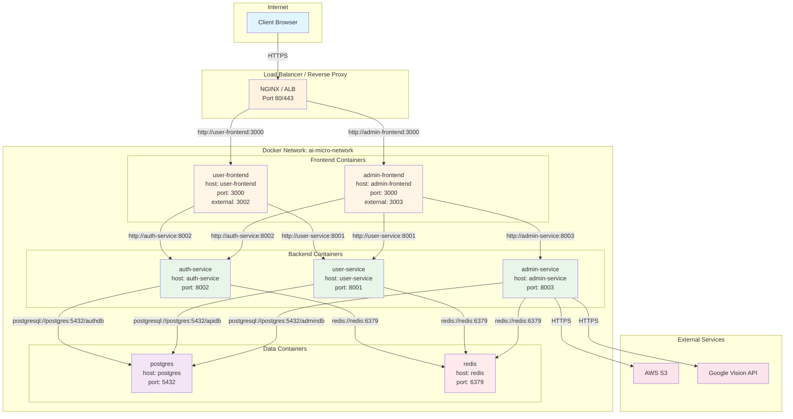

# ネットワーク構成図



## ポートマッピング

### 外部公開ポート (localhost)

| サービス | コンテナポート | 外部ポート | URL |
|---------|--------------|-----------|-----|
| User Frontend | 3000 | 3002 | http://localhost:3002 |
| Admin Frontend | 3000 | 3003 | http://localhost:3003 |
| Auth Service | 8002 | 8002 | http://localhost:8002 |
| User API | 8001 | 8001 | http://localhost:8001 |
| Admin API | 8003 | 8003 | http://localhost:8003 |
| PostgreSQL | 5432 | 5432 | postgresql://localhost:5432 |
| Redis | 6379 | 6379 | redis://localhost:6379 |

### 内部通信 (Docker Network)

コンテナ間は **サービス名** でホスト解決：

```bash
# Frontend → Backend
http://auth-service:8002
http://user-service:8001
http://admin-service:8003

# Backend → Database
postgresql://postgres:5432/authdb
postgresql://postgres:5432/apidb
postgresql://postgres:5432/admindb

# Backend → Cache
redis://redis:6379
```

## Docker Network設定

```yaml
# docker-compose.yml
networks:
  ai-micro-network:
    driver: bridge

services:
  user-frontend:
    networks:
      - ai-micro-network
  auth-service:
    networks:
      - ai-micro-network
  postgres:
    networks:
      - ai-micro-network
  redis:
    networks:
      - ai-micro-network
```

## 通信制御

### ファイアウォール設定

```bash
# 外部からのアクセス
- Port 80/443: Load Balancer (HTTPS)
- Port 3002/3003: Frontend (開発環境のみ)

# 内部通信のみ
- Port 8001/8002/8003: Backend API
- Port 5432: PostgreSQL
- Port 6379: Redis
```

### CORS設定

```python
# Backend API
allow_origins = [
    "http://localhost:3002",  # User Frontend
    "http://localhost:3003",  # Admin Frontend
    "https://app.example.com",  # Production
]
```

---

**関連ドキュメント**:
- [インフラ構成](../03-infrastructure.md)
- [Docker Compose](../../13-deployment/02-docker-compose.md)