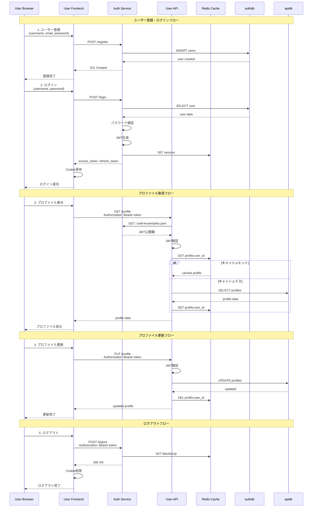

# サービス間通信図

## 通信パターン

### 1. 同期HTTP通信
- フロントエンド → バックエンドAPI
- バックエンドAPI間（JWT検証）

### 2. データベースアクセス
- Auth Service → authdb
- User API → apidb
- Admin API → admindb

### 3. キャッシュアクセス
- 全APIサービス → Redis
- セッション、JWT、プロファイルデータ

### 4. JWT検証フロー
- User/Admin API → Auth Service (JWKS)
- 公開鍵取得・キャッシュ

## 通信プロトコル

- **HTTP/REST**: フロントエンド ↔ バックエンド
- **PostgreSQL Protocol**: API ↔ Database
- **Redis Protocol**: API ↔ Redis

---

**関連ドキュメント**:
- [サービス間通信](../../08-integration/01-service-communication.md)
- [認証フロー](../../08-integration/02-authentication-flow.md)