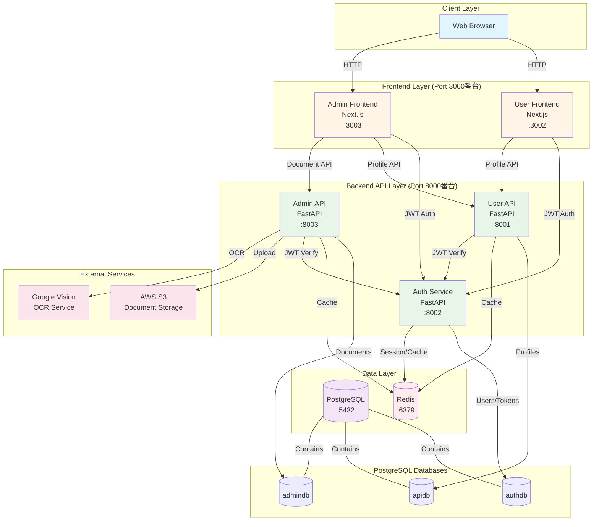

# システム全体概要図

## 概要

このシステムは以下の7つの主要コンポーネントで構成されています：

### フロントエンド層
- **User Frontend (Port 3002)**: エンドユーザー向けWebアプリケーション
- **Admin Frontend (Port 3003)**: 管理者向けWebアプリケーション

### バックエンドAPI層
- **Auth Service (Port 8002)**: 認証・認可サービス
- **User API (Port 8001)**: ユーザープロファイル管理
- **Admin API (Port 8003)**: ドキュメント管理・OCR処理

### データ層
- **PostgreSQL**: 3つのデータベース（authdb, apidb, admindb）
- **Redis**: セッション管理・キャッシュ

### 外部サービス
- **AWS S3**: ドキュメントストレージ
- **Google Vision API**: OCR処理

## 通信フロー

1. **認証フロー**: Frontend → Auth Service → authdb
2. **ユーザー操作**: Frontend → User API → apidb
3. **ドキュメント処理**: Admin Frontend → Admin API → admindb/S3/OCR
4. **キャッシュ**: 全APIサービス → Redis

---

**関連ドキュメント**:
- [システムアーキテクチャ](../01-system-architecture.md)
- [マイクロサービス連携](../02-microservices-integration.md)