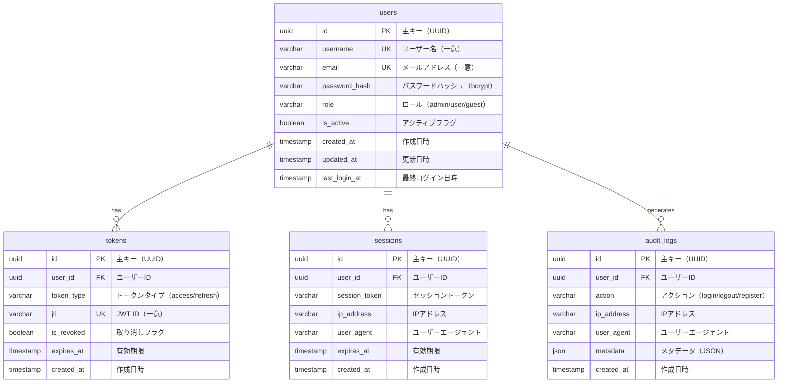

# authdb ER図



## テーブル詳細

### users テーブル

**主要カラム**:
- `id`: UUID型の主キー
- `username`: 一意のユーザー名（3-50文字）
- `email`: 一意のメールアドレス
- `password_hash`: bcryptでハッシュ化されたパスワード
- `role`: ユーザーロール（admin/user/guest）
- `is_active`: アカウントの有効/無効フラグ

**インデックス**:
```sql
CREATE INDEX idx_users_email ON users(email);
CREATE INDEX idx_users_username ON users(username);
CREATE INDEX idx_users_role ON users(role);
CREATE INDEX idx_users_is_active ON users(is_active);
```

**制約**:
```sql
ALTER TABLE users
    ADD CONSTRAINT chk_role CHECK (role IN ('admin', 'user', 'guest')),
    ADD CONSTRAINT chk_email_format CHECK (email ~* '^[A-Za-z0-9._%+-]+@[A-Za-z0-9.-]+\.[A-Z|a-z]{2,}$');
```

### tokens テーブル

**主要カラム**:
- `id`: UUID型の主キー
- `user_id`: usersテーブルへの外部キー
- `token_type`: access または refresh
- `jti`: JWT ID（一意、ブラックリスト管理用）
- `is_revoked`: 取り消しフラグ
- `expires_at`: トークン有効期限

**インデックス**:
```sql
CREATE INDEX idx_tokens_user_id ON tokens(user_id);
CREATE INDEX idx_tokens_jti ON tokens(jti);
CREATE INDEX idx_tokens_expires_at ON tokens(expires_at);
```

**用途**:
- JWTトークンの履歴管理
- ブラックリストとしても使用可能（is_revoked）
- 監査ログとして保存

### sessions テーブル

**主要カラム**:
- `id`: UUID型の主キー
- `user_id`: usersテーブルへの外部キー
- `session_token`: セッション識別子
- `ip_address`: ログイン元IPアドレス
- `user_agent`: ブラウザ情報
- `expires_at`: セッション有効期限

**インデックス**:
```sql
CREATE INDEX idx_sessions_user_id ON sessions(user_id);
CREATE INDEX idx_sessions_token ON sessions(session_token);
CREATE INDEX idx_sessions_expires_at ON sessions(expires_at);
```

**用途**:
- アクティブセッション管理
- 同時ログイン管理
- セキュリティ監視

### audit_logs テーブル

**主要カラム**:
- `id`: UUID型の主キー
- `user_id`: usersテーブルへの外部キー
- `action`: 実行されたアクション
- `ip_address`: アクセス元IPアドレス
- `user_agent`: ブラウザ情報
- `metadata`: 追加情報（JSON）

**インデックス**:
```sql
CREATE INDEX idx_audit_user_id ON audit_logs(user_id);
CREATE INDEX idx_audit_action ON audit_logs(action);
CREATE INDEX idx_audit_created_at ON audit_logs(created_at DESC);
```

**用途**:
- セキュリティ監査
- ユーザー行動追跡
- インシデント調査

## リレーション

### users → tokens (1:N)
- 1ユーザーが複数のトークンを持つ
- ログイン履歴として保存

### users → sessions (1:N)
- 1ユーザーが複数のセッションを持つ
- 複数デバイスからのログインに対応

### users → audit_logs (1:N)
- 1ユーザーが複数の監査ログを生成
- すべての認証関連アクションを記録

## データ例

### users
```sql
INSERT INTO users VALUES (
    '123e4567-e89b-12d3-a456-426614174000',
    'john_doe',
    'john@example.com',
    '$2b$12$LQv3c1yqBWVHxkd0LHAkCOYz6TtxMQJqhN8/LeGN8sCk3fSKkM5W2',
    'user',
    true,
    '2024-01-01 10:00:00',
    '2024-01-01 10:00:00',
    '2024-01-15 09:30:00'
);
```

### tokens
```sql
INSERT INTO tokens VALUES (
    '223e4567-e89b-12d3-a456-426614174001',
    '123e4567-e89b-12d3-a456-426614174000',
    'access',
    'abc123-def456-ghi789',
    false,
    '2024-01-15 10:00:00',
    '2024-01-15 09:45:00'
);
```

---

**関連ドキュメント**:
- [データベース設計](../04-database-design.md)
- [全体ER図](../../06-database/07-er-diagram.md)
- [authdbスキーマ](../../06-database/04-authdb-schema.md)