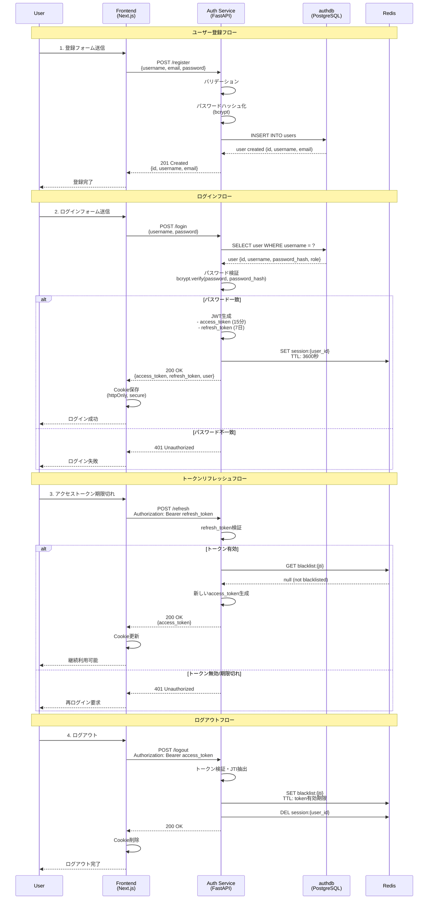

# 認証フロー図

## フローの詳細

### 1. ユーザー登録
- パスワードをbcryptでハッシュ化
- authdbにユーザー情報を保存
- パスワードは平文で保存しない

### 2. ログイン
- ユーザー名でDB検索
- bcryptでパスワード検証
- JWT生成（RS256署名）
- Redisにセッション保存

### 3. トークンリフレッシュ
- refresh_tokenで新しいaccess_token取得
- ブラックリスト確認
- 無効なトークンは拒否

### 4. ログアウト
- トークンをブラックリストに追加
- セッション削除
- フロントエンドのCookie削除

## セキュリティ対策

- パスワードハッシュ化（bcrypt、rounds=12）
- JWT署名（RS256）
- httpOnly Cookie（XSS対策）
- Token Blacklist（ログアウト確実化）
- セッションタイムアウト（1時間）

---

**関連ドキュメント**:
- [JWT設計](../03-jwt-design.md)
- [セキュリティ実装](../05-security-implementation.md)
- [認証フロー統合](../../08-integration/02-authentication-flow.md)