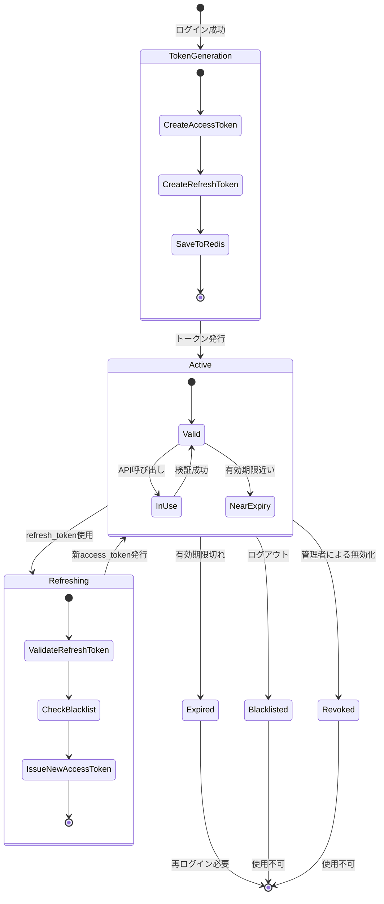
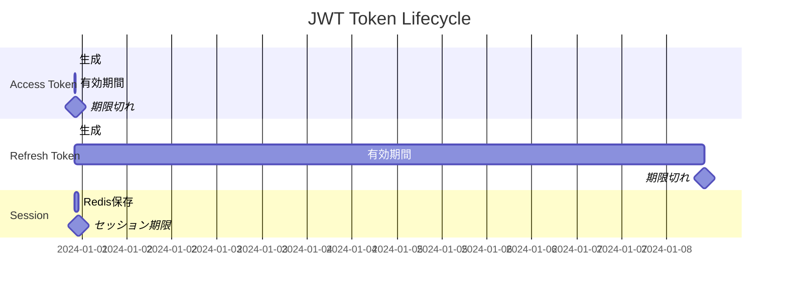
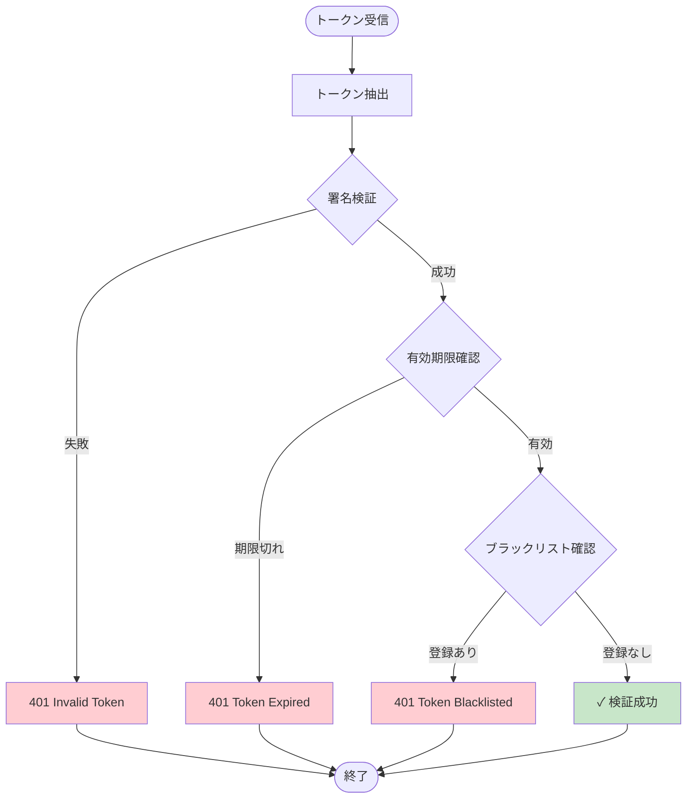

# トークンライフサイクル図

## トークンの状態

### 1. Token Generation (生成)
- **access_token**: 有効期限15分
- **refresh_token**: 有効期限7日
- Redisにセッション保存（TTL: 1時間）

### 2. Active (有効)
- JWT検証成功
- 有効期限内
- ブラックリストに未登録

### 3. Near Expiry (期限間近)
- 残り有効期限が5分未満
- フロントエンドで自動リフレッシュ推奨

### 4. Refreshing (リフレッシュ中)
- refresh_tokenで新access_token取得
- ブラックリスト確認
- 新トークン発行

### 5. Expired (期限切れ)
- 有効期限超過
- 401 Unauthorized
- 再ログインまたはリフレッシュ必要

### 6. Blacklisted (ブラックリスト登録)
- ログアウト時に登録
- 使用不可
- Redis TTL: 元の有効期限まで

### 7. Revoked (取り消し)
- 管理者による強制無効化
- セキュリティインシデント時

## トークンタイムライン

## トークン検証フロー

## トークン管理戦略

### Access Token
- **有効期限**: 15分
- **用途**: API認証
- **保存場所**: httpOnly Cookie
- **リフレッシュ**: 自動（期限間近時）

### Refresh Token
- **有効期限**: 7日
- **用途**: access_token再発行
- **保存場所**: httpOnly Cookie
- **ローテーション**: 使用時に新規発行推奨

### Blacklist（Redis）
- **キー**: `blacklist:{jti}`
- **TTL**: トークン元の有効期限
- **用途**: ログアウト時の無効化

### Session（Redis）
- **キー**: `session:{user_id}`
- **TTL**: 3600秒（1時間）
- **用途**: アクティブセッション管理

---

**関連ドキュメント**:
- [JWT設計](../03-jwt-design.md)
- [認証フロー](./authentication-flow.md)
- [Redis使用](../../07-redis/03-auth-service-usage.md)