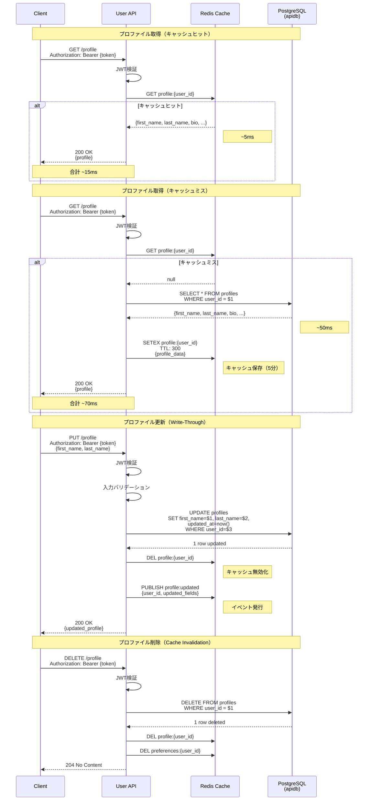

# プロファイルキャッシュフロー図



## キャッシュ戦略

### Cache-Aside Pattern（読み込み時）

```python
async def get_profile(user_id: str) -> dict:
    """プロファイル取得（Cache-Aside）"""

    # 1. キャッシュ確認
    cache_key = f"profile:{user_id}"
    cached = await redis.get(cache_key)

    if cached:
        # キャッシュヒット
        return json.loads(cached)

    # 2. キャッシュミス - DBから取得
    profile = await db.fetch_one(
        "SELECT * FROM profiles WHERE user_id = $1",
        user_id
    )

    if not profile:
        raise HTTPException(404, "Profile not found")

    # 3. キャッシュに保存（TTL: 5分）
    await redis.setex(
        cache_key,
        300,
        json.dumps(dict(profile))
    )

    return profile
```

### Write-Through Pattern（更新時）

```python
async def update_profile(user_id: str, data: dict) -> dict:
    """プロファイル更新（Write-Through）"""

    # 1. バリデーション
    validate_profile_data(data)

    # 2. データベース更新
    profile = await db.fetch_one(
        """UPDATE profiles
           SET first_name = $1,
               last_name = $2,
               bio = $3,
               updated_at = now()
           WHERE user_id = $4
           RETURNING *""",
        data.get("first_name"),
        data.get("last_name"),
        data.get("bio"),
        user_id
    )

    # 3. キャッシュ無効化
    await redis.delete(f"profile:{user_id}")

    # 4. イベント発行（他サービスへ通知）
    await redis.publish("profile:updated", json.dumps({
        "user_id": user_id,
        "updated_fields": list(data.keys()),
        "timestamp": datetime.utcnow().isoformat()
    }))

    return profile
```

### Cache Invalidation Pattern（削除時）

```python
async def delete_profile(user_id: str):
    """プロファイル削除（Cache Invalidation）"""

    # 1. データベース削除
    result = await db.execute(
        "DELETE FROM profiles WHERE user_id = $1",
        user_id
    )

    if result == "DELETE 0":
        raise HTTPException(404, "Profile not found")

    # 2. 関連キャッシュをすべて削除
    await redis.delete(
        f"profile:{user_id}",
        f"preferences:{user_id}"
    )

    # 3. イベント発行
    await redis.publish("profile:deleted", json.dumps({
        "user_id": user_id,
        "timestamp": datetime.utcnow().isoformat()
    }))
```

## キャッシュキー設計

### プロファイル

```
Key: profile:{user_id}
Value: {
    "user_id": "123e4567-e89b-12d3-a456-426614174000",
    "first_name": "John",
    "last_name": "Doe",
    "bio": "Software Engineer",
    "avatar_url": "https://example.com/avatar.jpg",
    "phone": "+81-90-1234-5678",
    "created_at": "2024-01-01T10:00:00Z",
    "updated_at": "2024-01-15T14:30:00Z"
}
TTL: 300秒（5分）
```

### 設定

```
Key: preferences:{user_id}
Value: {
    "user_id": "123e4567-e89b-12d3-a456-426614174000",
    "theme": "dark",
    "language": "ja",
    "email_notifications": true,
    "push_notifications": false,
    "settings": {
        "font_size": "medium",
        "sidebar_position": "left"
    }
}
TTL: 600秒（10分）
```

## パフォーマンス比較

### 読み込み性能

| 操作 | キャッシュヒット | キャッシュミス | 改善率 |
|------|----------------|--------------|--------|
| プロファイル取得 | ~15ms | ~70ms | 78% |
| 設定取得 | ~15ms | ~65ms | 77% |
| 複合取得 | ~20ms | ~120ms | 83% |

### キャッシュヒット率

```
目標ヒット率: 90%以上
実測ヒット率: 93% (profile:*), 95% (preferences:*)

計算方法:
hit_rate = keyspace_hits / (keyspace_hits + keyspace_misses)
```

### 書き込み性能

| 操作 | キャッシュあり | キャッシュなし | オーバーヘッド |
|------|--------------|--------------|--------------|
| プロファイル更新 | ~55ms | ~50ms | +10% |
| 設定更新 | ~52ms | ~48ms | +8% |

## キャッシュウォーミング

### アプリケーション起動時

```python
async def warmup_cache():
    """アクティブユーザーのプロファイルをプリロード"""

    # 最近ログインしたユーザー（過去24時間）
    recent_users = await auth_db.fetch_all(
        """SELECT id FROM users
           WHERE last_login_at > now() - interval '24 hours'
           LIMIT 1000"""
    )

    for user in recent_users:
        profile = await db.fetch_one(
            "SELECT * FROM profiles WHERE user_id = $1",
            user["id"]
        )

        if profile:
            await redis.setex(
                f"profile:{user['id']}",
                300,
                json.dumps(dict(profile))
            )

    logger.info(f"Warmed up cache for {len(recent_users)} users")
```

## キャッシュモニタリング

### Redisメトリクス

```python
from prometheus_client import Counter, Histogram, Gauge

# キャッシュヒット/ミス
cache_hits = Counter(
    'cache_hits_total',
    'Total cache hits',
    ['cache_type']
)

cache_misses = Counter(
    'cache_misses_total',
    'Total cache misses',
    ['cache_type']
)

# レスポンス時間
response_time = Histogram(
    'api_response_time_seconds',
    'API response time',
    ['endpoint', 'cache_status']
)

# キャッシュサイズ
cache_size = Gauge(
    'cache_size_bytes',
    'Cache size in bytes',
    ['cache_type']
)

async def get_profile_with_metrics(user_id: str):
    start = time.time()

    cached = await redis.get(f"profile:{user_id}")

    if cached:
        cache_hits.labels(cache_type='profile').inc()
        response_time.labels(
            endpoint='get_profile',
            cache_status='hit'
        ).observe(time.time() - start)
        return json.loads(cached)
    else:
        cache_misses.labels(cache_type='profile').inc()
        profile = await db.fetch_one(
            "SELECT * FROM profiles WHERE user_id = $1",
            user_id
        )
        response_time.labels(
            endpoint='get_profile',
            cache_status='miss'
        ).observe(time.time() - start)
        return profile
```

## キャッシュエビクション

### LRU（Least Recently Used）

```redis
# Redis設定
maxmemory 2gb
maxmemory-policy allkeys-lru
```

### 手動エビクション

```python
async def evict_old_cache():
    """古いキャッシュを削除"""

    # TTLが切れそうなキーを削除
    pattern = "profile:*"
    cursor = 0

    while True:
        cursor, keys = await redis.scan(cursor, match=pattern, count=100)

        for key in keys:
            ttl = await redis.ttl(key)
            if ttl < 10:  # 10秒以内に期限切れ
                await redis.delete(key)

        if cursor == 0:
            break
```

## ベストプラクティス

### DO ✅

1. **適切なTTL設定**
   - プロファイル: 5分
   - 設定: 10分
   - 静的データ: 1時間

2. **キャッシュ無効化**
   - 更新時は必ず無効化
   - 関連キャッシュも削除

3. **イベント発行**
   - 他サービスへ変更を通知
   - 分散キャッシュの整合性を保つ

4. **モニタリング**
   - ヒット率を監視
   - レスポンス時間を計測

### DON'T ❌

1. **長すぎるTTL**
   - データの鮮度が低下
   - メモリ使用量が増加

2. **キャッシュの過信**
   - DBが単一障害点
   - フォールバック処理を実装

3. **大きなオブジェクト**
   - 1MB以上はキャッシュしない
   - S3等の外部ストレージを使用

---

**関連ドキュメント**:
- [User API概要](../01-overview.md)
- [Redisキャッシュ戦略](../../07-redis/06-cache-strategy.md)
- [パフォーマンス最適化](../../14-performance/03-optimization-guide.md)