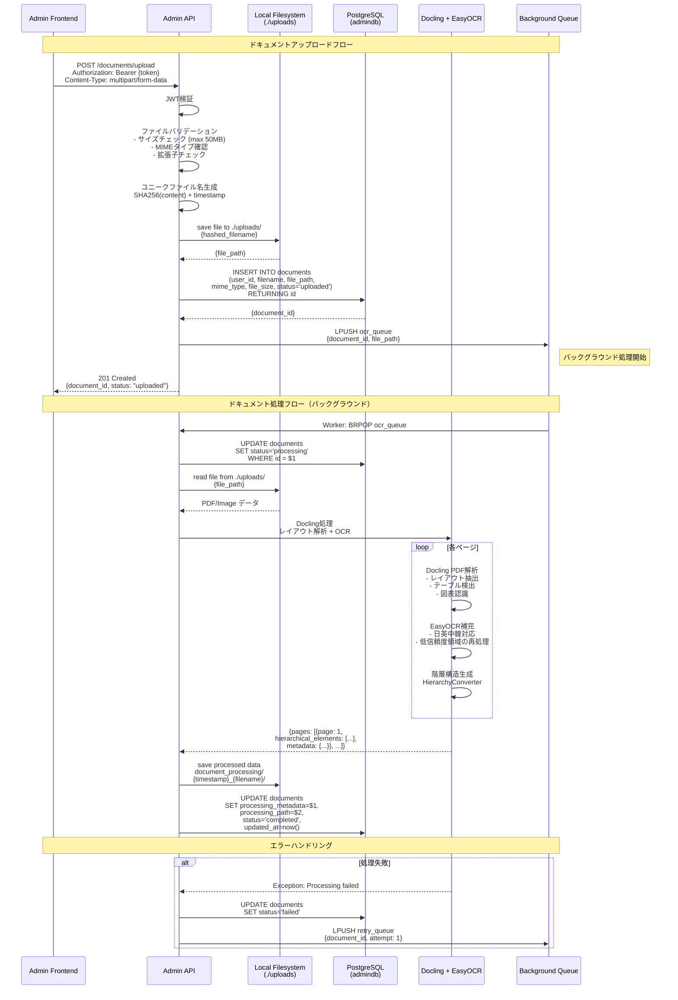

# ドキュメント処理フロー図



## 処理ステージ詳細

### 1. アップロード検証（~100ms）

```python
async def validate_upload(file: UploadFile, user_id: str):
    """アップロードファイルの検証"""

    # 1. ファイルサイズチェック
    if file.size > 50 * 1024 * 1024:  # 50MB
        raise HTTPException(413, "File too large")

    # 2. MIMEタイプチェック
    allowed_types = ["application/pdf", "image/png", "image/jpeg"]
    if file.content_type not in allowed_types:
        raise HTTPException(415, "Unsupported file type")

    # 3. 拡張子チェック
    allowed_extensions = [".pdf", ".png", ".jpg", ".jpeg"]
    if not any(file.filename.lower().endswith(ext) for ext in allowed_extensions):
        raise HTTPException(400, "Invalid file extension")

    return True
```

### 2. ローカルファイルシステムへの保存（~100ms）

```python
def save_uploaded_file(
    file_content: bytes,
    filename: str,
    upload_dir: Path = UPLOAD_BASE_DIR
) -> Dict[str, Any]:
    """ローカルファイルシステムへのファイル保存"""

    # ユニークファイル名生成（SHA256 + タイムスタンプ）
    file_hash = hashlib.sha256(file_content).hexdigest()[:16]
    timestamp = datetime.now().strftime("%Y%m%d_%H%M%S")
    file_extension = Path(filename).suffix
    hashed_filename = f"{timestamp}_{file_hash}{file_extension}"

    # アップロードディレクトリ作成
    upload_dir.mkdir(parents=True, exist_ok=True)

    # ファイル保存
    file_path = upload_dir / hashed_filename
    with open(file_path, "wb") as f:
        f.write(file_content)

    return {
        "hashed_filename": hashed_filename,
        "file_extension": file_extension,
        "file_path": str(file_path)
    }
```

### 3. ドキュメント処理（Docling + EasyOCR）（~30-90秒）

```python
async def process_document(document_id: str, file_path: str):
    """Doclingによるドキュメント処理"""

    # 1. ファイル読み込み
    with open(file_path, "rb") as f:
        file_data = f.read()

    # 2. Docling処理
    from app.core.document_processing.base import DocumentProcessor

    processor = DocumentProcessor()
    result = await processor.process_pdf(
        pdf_path=file_path,
        output_dir=f"document_processing/{document_id}"
    )

    # 3. 階層構造データ取得
    hierarchical_elements = []
    for page_num, page_data in enumerate(result["pages"], start=1):
        # Doclingレイアウト解析結果
        elements = page_data.get("hierarchical_elements", [])

        # EasyOCRで低信頼度領域を補完
        for element in elements:
            if element.get("confidence", 1.0) < 0.7:
                # EasyOCRで再処理
                enhanced_text = await ocr_region_with_easyocr(
                    image_path=page_data["image_path"],
                    bbox=element["bbox"]
                )
                element["text"] = enhanced_text

        hierarchical_elements.extend(elements)

    # 4. 処理結果保存
    processing_metadata = {
        "total_pages": len(result["pages"]),
        "processing_mode": result["mode"],
        "timestamp": datetime.utcnow().isoformat()
    }

    # 5. データベース更新
    await db.execute(
        """UPDATE documents
           SET ocr_result = $1,
               hierarchical_elements = $2,
               status = 'completed',
               processed_at = now()
           WHERE id = $3""",
        json.dumps(ocr_results),
        json.dumps(hierarchical_elements),
        document_id
    )

    return ocr_results
```

### 4. 階層構造変換（~1秒）

```python
class HierarchyConverter:
    """OCRテキストを階層構造に変換"""

    def __init__(self):
        self.global_element_counter = 0

    def convert(self, ocr_results: list) -> list:
        """OCR結果を階層構造に変換"""

        hierarchical_elements = []

        for page_result in ocr_results:
            page_num = page_result["page"]
            text = page_result["text"]

            # テキストを行に分割
            lines = text.split("\n")

            for line in lines:
                if not line.strip():
                    continue

                # 要素タイプを判定
                element_type = self._detect_type(line)

                # 階層要素を作成
                element = {
                    "id": self._generate_id(),
                    "type": element_type,
                    "text": line.strip(),
                    "page": page_num,
                    "level": self._detect_level(line, element_type)
                }

                hierarchical_elements.append(element)

        return hierarchical_elements

    def _generate_id(self) -> str:
        """一意のID生成"""
        self.global_element_counter += 1
        return f"ID-{self.global_element_counter}"

    def _detect_type(self, line: str) -> str:
        """行のタイプを判定"""
        line = line.strip()

        # 見出しパターン
        if re.match(r"^#+\s", line):
            return "heading"
        if re.match(r"^\d+\.\s", line):
            return "list_item"
        if line.isupper() and len(line) < 50:
            return "heading"

        # リストパターン
        if re.match(r"^[-*]\s", line):
            return "list_item"

        # デフォルトは段落
        return "paragraph"

    def _detect_level(self, line: str, element_type: str) -> int:
        """階層レベルを判定"""
        if element_type == "heading":
            if re.match(r"^#\s", line):
                return 1
            if re.match(r"^##\s", line):
                return 2
            return 1

        if element_type == "list_item":
            indent = len(line) - len(line.lstrip())
            return (indent // 2) + 2

        return 2
```

## エラーハンドリング

### リトライメカニズム

```python
async def retry_ocr_processing(document_id: str, attempt: int = 1):
    """OCR処理のリトライ"""

    max_attempts = 3

    if attempt > max_attempts:
        # 最大リトライ回数超過
        await db.execute(
            """UPDATE documents
               SET status = 'failed'
               WHERE id = $1""",
            document_id
        )
        logger.error(f"OCR failed after {max_attempts} attempts: {document_id}")
        return

    try:
        # OCR処理実行
        await process_ocr(document_id, s3_key)
    except Exception as e:
        # エラーログ記録
        await db.execute(
            """INSERT INTO processing_logs
               (document_id, stage, status, error_message)
               VALUES ($1, 'ocr', 'failed', $2)""",
            document_id, str(e)
        )

        # Exponential backoff
        await asyncio.sleep(2 ** attempt)

        # リトライキューに追加
        await redis.lpush("retry_queue", json.dumps({
            "document_id": document_id,
            "attempt": attempt + 1
        }))
```

## パフォーマンス最適化

### 並列処理

```python
async def process_multiple_documents(document_ids: list):
    """複数ドキュメントの並列処理"""

    # 最大5並列
    semaphore = asyncio.Semaphore(5)

    async def process_with_limit(doc_id):
        async with semaphore:
            return await process_ocr(doc_id)

    results = await asyncio.gather(
        *[process_with_limit(doc_id) for doc_id in document_ids],
        return_exceptions=True
    )

    return results
```

### 画像前処理の最適化

```python
def preprocess_image(image: Image) -> Image:
    """OCR精度向上のための画像前処理"""

    # 1. グレースケール変換
    image = image.convert("L")

    # 2. ノイズ除去
    image = cv2.fastNlMeansDenoising(
        np.array(image),
        None,
        h=10,
        templateWindowSize=7,
        searchWindowSize=21
    )

    # 3. 二値化（Otsuの手法）
    _, image = cv2.threshold(
        image,
        0,
        255,
        cv2.THRESH_BINARY + cv2.THRESH_OTSU
    )

    # 4. リサイズ（高解像度化）
    image = cv2.resize(
        image,
        None,
        fx=2.0,
        fy=2.0,
        interpolation=cv2.INTER_CUBIC
    )

    return Image.fromarray(image)
```

## モニタリング

### 処理時間の計測

```python
from prometheus_client import Histogram

ocr_processing_time = Histogram(
    'ocr_processing_seconds',
    'OCR processing time',
    ['stage']
)

@ocr_processing_time.labels(stage='upload').time()
async def upload_document(file: UploadFile):
    # アップロード処理
    pass

@ocr_processing_time.labels(stage='ocr').time()
async def process_ocr(document_id: str):
    # OCR処理
    pass
```

## ベストプラクティス

### DO ✅

1. **バックグラウンド処理**
   - 重い処理は非同期で実行
   - ユーザーを待たせない

2. **リトライメカニズム**
   - 一時的なエラーに対応
   - Exponential backoffを使用

3. **画像前処理**
   - OCR精度を向上
   - ノイズ除去と二値化

4. **クォータ管理**
   - アップロード前にチェック
   - ストレージ使用量を追跡

### DON'T ❌

1. **同期処理**
   - OCRを同期的に実行しない
   - タイムアウトのリスク

2. **無制限アップロード**
   - ファイルサイズを制限
   - クォータを設定

3. **エラー無視**
   - 失敗を記録
   - リトライまたは通知

---

**関連ドキュメント**:
- [Admin API概要](../01-overview.md)
- [OCR処理](../04-ocr-design.md)
- [階層構造変換](../05-hierarchy-converter.md)