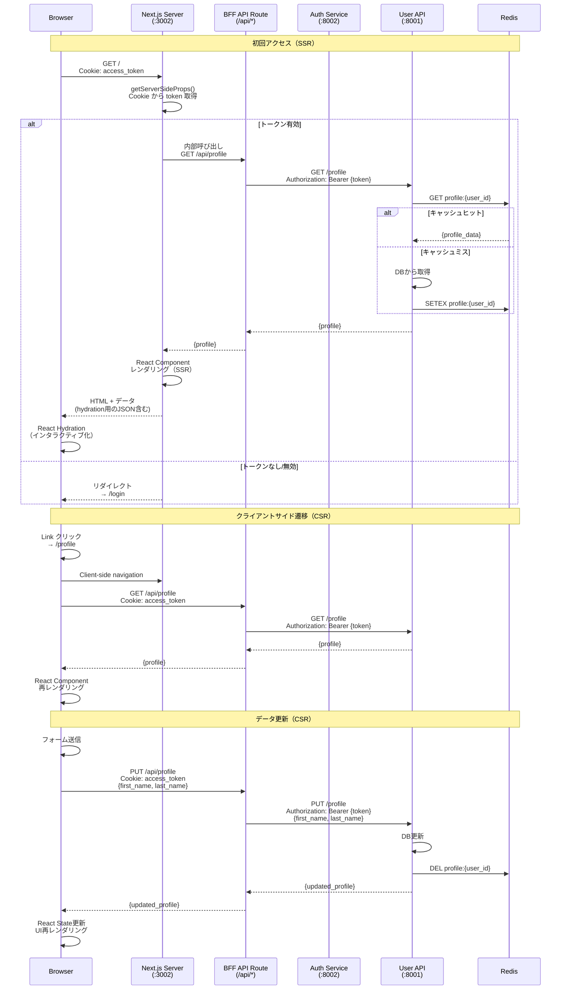

# ページレンダリングフロー図



## レンダリングモード

### 1. SSR (Server-Side Rendering)

**用途**: 初回ページロード、SEO重要ページ

```typescript
// pages/index.tsx
import { GetServerSideProps } from 'next';

export const getServerSideProps: GetServerSideProps = async (context) => {
  // Cookieからトークン取得
  const token = context.req.cookies.access_token;

  if (!token) {
    return {
      redirect: {
        destination: '/login',
        permanent: false,
      },
    };
  }

  try {
    // BFF経由でプロファイル取得
    const profile = await fetch(`http://localhost:3002/api/profile`, {
      headers: {
        Cookie: `access_token=${token}`,
      },
    }).then(res => res.json());

    return {
      props: {
        profile,
      },
    };
  } catch (error) {
    return {
      redirect: {
        destination: '/login',
        permanent: false,
      },
    };
  }
};

export default function Home({ profile }: { profile: Profile }) {
  return (
    <div>
      <h1>Welcome, {profile.first_name}!</h1>
      {/* プロファイル表示 */}
    </div>
  );
}
```

### 2. CSR (Client-Side Rendering)

**用途**: インタラクティブなページ、頻繁に更新されるデータ

```typescript
// pages/dashboard.tsx
import { useEffect, useState } from 'react';
import { useRouter } from 'next/router';

export default function Dashboard() {
  const [profile, setProfile] = useState<Profile | null>(null);
  const [loading, setLoading] = useState(true);
  const router = useRouter();

  useEffect(() => {
    fetchProfile();
  }, []);

  const fetchProfile = async () => {
    try {
      const response = await fetch('/api/profile');

      if (!response.ok) {
        throw new Error('Failed to fetch profile');
      }

      const data = await response.json();
      setProfile(data);
    } catch (error) {
      // 認証エラーの場合はログイン画面へ
      router.push('/login');
    } finally {
      setLoading(false);
    }
  };

  if (loading) {
    return <LoadingSpinner />;
  }

  return (
    <div>
      <h1>Dashboard</h1>
      {profile && <ProfileCard profile={profile} />}
    </div>
  );
}
```

### 3. ISR (Incremental Static Regeneration)

**用途**: 静的ページで定期的に更新が必要なコンテンツ

```typescript
// pages/about.tsx
import { GetStaticProps } from 'next';

export const getStaticProps: GetStaticProps = async () => {
  // 静的データ取得
  const data = await fetchStaticData();

  return {
    props: {
      data,
    },
    revalidate: 3600, // 1時間ごとに再生成
  };
};

export default function About({ data }: { data: any }) {
  return (
    <div>
      <h1>About Us</h1>
      {/* 静的コンテンツ */}
    </div>
  );
}
```

## BFF API Routes

### プロファイル取得

```typescript
// pages/api/profile.ts
import { NextApiRequest, NextApiResponse } from 'next';

export default async function handler(
  req: NextApiRequest,
  res: NextApiResponse
) {
  if (req.method !== 'GET') {
    return res.status(405).json({ error: 'Method not allowed' });
  }

  // Cookieからトークン取得
  const token = req.cookies.access_token;

  if (!token) {
    return res.status(401).json({ error: 'Unauthorized' });
  }

  try {
    // User APIへプロキシ
    const response = await fetch(
      `${process.env.API_SERVER_URL}/profile`,
      {
        headers: {
          Authorization: `Bearer ${token}`,
        },
      }
    );

    if (!response.ok) {
      throw new Error(`API error: ${response.status}`);
    }

    const profile = await response.json();

    return res.status(200).json(profile);
  } catch (error) {
    console.error('Profile fetch error:', error);
    return res.status(500).json({ error: 'Internal server error' });
  }
}
```

### プロファイル更新

```typescript
// pages/api/profile.ts
export default async function handler(
  req: NextApiRequest,
  res: NextApiResponse
) {
  if (req.method === 'PUT') {
    const token = req.cookies.access_token;

    if (!token) {
      return res.status(401).json({ error: 'Unauthorized' });
    }

    try {
      // バリデーション
      const { first_name, last_name, bio } = req.body;

      // User APIへプロキシ
      const response = await fetch(
        `${process.env.API_SERVER_URL}/profile`,
        {
          method: 'PUT',
          headers: {
            Authorization: `Bearer ${token}`,
            'Content-Type': 'application/json',
          },
          body: JSON.stringify({ first_name, last_name, bio }),
        }
      );

      if (!response.ok) {
        throw new Error(`API error: ${response.status}`);
      }

      const profile = await response.json();

      return res.status(200).json(profile);
    } catch (error) {
      console.error('Profile update error:', error);
      return res.status(500).json({ error: 'Internal server error' });
    }
  }
}
```

## React State管理

### Context API

```typescript
// contexts/AuthContext.tsx
import { createContext, useContext, useState, useEffect } from 'react';

interface AuthContextType {
  user: User | null;
  profile: Profile | null;
  loading: boolean;
  login: (username: string, password: string) => Promise<void>;
  logout: () => Promise<void>;
  updateProfile: (data: Partial<Profile>) => Promise<void>;
}

const AuthContext = createContext<AuthContextType | undefined>(undefined);

export function AuthProvider({ children }: { children: React.ReactNode }) {
  const [user, setUser] = useState<User | null>(null);
  const [profile, setProfile] = useState<Profile | null>(null);
  const [loading, setLoading] = useState(true);

  useEffect(() => {
    // 初回ロード時にプロファイル取得
    fetchProfile();
  }, []);

  const fetchProfile = async () => {
    try {
      const response = await fetch('/api/profile');
      if (response.ok) {
        const data = await response.json();
        setProfile(data);
      }
    } catch (error) {
      console.error('Failed to fetch profile:', error);
    } finally {
      setLoading(false);
    }
  };

  const login = async (username: string, password: string) => {
    const response = await fetch('/api/auth/login', {
      method: 'POST',
      headers: { 'Content-Type': 'application/json' },
      body: JSON.stringify({ username, password }),
    });

    if (!response.ok) {
      throw new Error('Login failed');
    }

    await fetchProfile();
  };

  const logout = async () => {
    await fetch('/api/auth/logout', { method: 'POST' });
    setUser(null);
    setProfile(null);
  };

  const updateProfile = async (data: Partial<Profile>) => {
    const response = await fetch('/api/profile', {
      method: 'PUT',
      headers: { 'Content-Type': 'application/json' },
      body: JSON.stringify(data),
    });

    if (!response.ok) {
      throw new Error('Profile update failed');
    }

    const updated = await response.json();
    setProfile(updated);
  };

  return (
    <AuthContext.Provider
      value={{ user, profile, loading, login, logout, updateProfile }}
    >
      {children}
    </AuthContext.Provider>
  );
}

export function useAuth() {
  const context = useContext(AuthContext);
  if (!context) {
    throw new Error('useAuth must be used within AuthProvider');
  }
  return context;
}
```

### 使用例

```typescript
// pages/profile.tsx
import { useAuth } from '@/contexts/AuthContext';

export default function ProfilePage() {
  const { profile, updateProfile, loading } = useAuth();
  const [isEditing, setIsEditing] = useState(false);

  const handleSubmit = async (data: Partial<Profile>) => {
    try {
      await updateProfile(data);
      setIsEditing(false);
    } catch (error) {
      console.error('Update failed:', error);
    }
  };

  if (loading) {
    return <LoadingSpinner />;
  }

  return (
    <div>
      <h1>Profile</h1>
      {isEditing ? (
        <ProfileEditForm profile={profile} onSubmit={handleSubmit} />
      ) : (
        <ProfileDisplay profile={profile} onEdit={() => setIsEditing(true)} />
      )}
    </div>
  );
}
```

## パフォーマンス最適化

### 1. コード分割

```typescript
// 動的インポート
import dynamic from 'next/dynamic';

const HeavyComponent = dynamic(() => import('@/components/HeavyComponent'), {
  loading: () => <LoadingSpinner />,
  ssr: false, // クライアントサイドのみでロード
});
```

### 2. 画像最適化

```typescript
import Image from 'next/image';

<Image
  src={profile.avatar_url}
  alt="Profile"
  width={200}
  height={200}
  priority // LCP改善
/>
```

### 3. データプリフェッチ

```typescript
import { useRouter } from 'next/router';
import Link from 'next/link';

// リンクホバー時にプリフェッチ
<Link href="/dashboard" prefetch={true}>
  <a>Dashboard</a>
</Link>
```

## エラーハンドリング

### エラーバウンダリ

```typescript
// components/ErrorBoundary.tsx
import React, { Component, ErrorInfo, ReactNode } from 'react';

interface Props {
  children: ReactNode;
}

interface State {
  hasError: boolean;
  error?: Error;
}

export class ErrorBoundary extends Component<Props, State> {
  constructor(props: Props) {
    super(props);
    this.state = { hasError: false };
  }

  static getDerivedStateFromError(error: Error): State {
    return { hasError: true, error };
  }

  componentDidCatch(error: Error, errorInfo: ErrorInfo) {
    console.error('Error caught by boundary:', error, errorInfo);
  }

  render() {
    if (this.state.hasError) {
      return (
        <div>
          <h1>Something went wrong</h1>
          <p>{this.state.error?.message}</p>
        </div>
      );
    }

    return this.props.children;
  }
}
```

## ベストプラクティス

### DO ✅

1. **SSRを活用**
   - 初回ロードの高速化
   - SEO対策

2. **BFFパターン**
   - バックエンドAPIへのプロキシ
   - トークン管理の一元化

3. **エラーハンドリング**
   - エラーバウンダリの実装
   - ユーザーフレンドリーなエラーメッセージ

4. **パフォーマンス最適化**
   - コード分割
   - 画像最適化
   - プリフェッチ

### DON'T ❌

1. **トークンをクライアントに公開**
   - httpOnly Cookieを使用
   - LocalStorageは避ける

2. **過度なクライアントサイドレンダリング**
   - 初回ロードが遅くなる
   - SEOに不利

3. **エラーの無視**
   - 必ずエラーハンドリング
   - ユーザーへのフィードバック

---

**関連ドキュメント**:
- [User Frontend概要](../01-overview.md)
- [認証フロー](../../08-integration/02-authentication-flow.md)
- [BFFパターン](../../08-integration/07-bff-pattern.md)
- [パフォーマンス最適化](../../14-performance/03-optimization-guide.md)