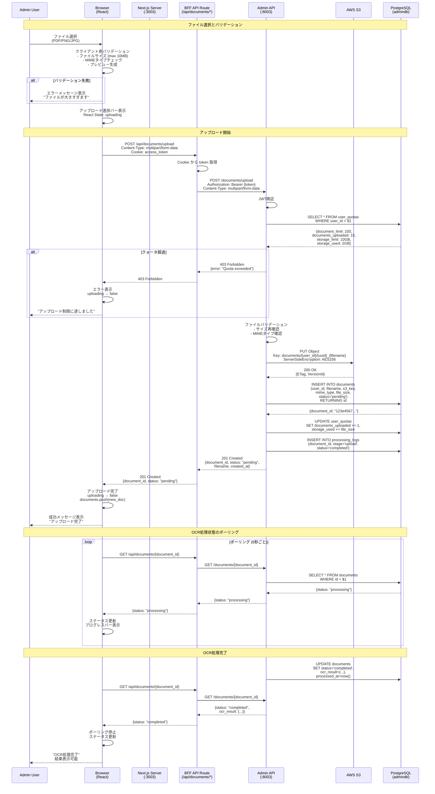

# ドキュメントアップロードフロー図



## クライアント側実装

### ファイルアップロードコンポーネント

```typescript
// components/DocumentUpload.tsx
import { useState, useCallback } from 'react';
import { useDropzone } from 'react-dropzone';

interface DocumentUploadProps {
  onUploadComplete: (document: Document) => void;
}

export function DocumentUpload({ onUploadComplete }: DocumentUploadProps) {
  const [uploading, setUploading] = useState(false);
  const [progress, setProgress] = useState(0);
  const [error, setError] = useState<string | null>(null);

  const onDrop = useCallback(async (acceptedFiles: File[]) => {
    const file = acceptedFiles[0];

    // クライアント側バリデーション
    if (file.size > 10 * 1024 * 1024) {
      setError('ファイルサイズは10MB以下にしてください');
      return;
    }

    const allowedTypes = ['application/pdf', 'image/png', 'image/jpeg'];
    if (!allowedTypes.includes(file.type)) {
      setError('PDF、PNG、JPGファイルのみアップロード可能です');
      return;
    }

    setUploading(true);
    setError(null);
    setProgress(0);

    try {
      // FormData作成
      const formData = new FormData();
      formData.append('file', file);

      // アップロード実行
      const response = await fetch('/api/documents/upload', {
        method: 'POST',
        body: formData,
      });

      if (!response.ok) {
        const error = await response.json();
        throw new Error(error.message || 'アップロードに失敗しました');
      }

      const document = await response.json();

      // OCR処理完了まで待機
      await pollDocumentStatus(document.id);

      onUploadComplete(document);
    } catch (err) {
      setError(err instanceof Error ? err.message : '不明なエラー');
    } finally {
      setUploading(false);
    }
  }, [onUploadComplete]);

  const pollDocumentStatus = async (documentId: string): Promise<void> => {
    return new Promise((resolve, reject) => {
      const interval = setInterval(async () => {
        try {
          const response = await fetch(`/api/documents/${documentId}`);
          const document = await response.json();

          if (document.status === 'completed') {
            clearInterval(interval);
            resolve();
          } else if (document.status === 'failed') {
            clearInterval(interval);
            reject(new Error('OCR処理に失敗しました'));
          }

          // 進捗更新（仮に50-100%の範囲で更新）
          setProgress(document.status === 'processing' ? 75 : 50);
        } catch (err) {
          clearInterval(interval);
          reject(err);
        }
      }, 5000); // 5秒ごとにポーリング

      // タイムアウト（5分）
      setTimeout(() => {
        clearInterval(interval);
        reject(new Error('処理がタイムアウトしました'));
      }, 5 * 60 * 1000);
    });
  };

  const { getRootProps, getInputProps, isDragActive } = useDropzone({
    onDrop,
    accept: {
      'application/pdf': ['.pdf'],
      'image/png': ['.png'],
      'image/jpeg': ['.jpg', '.jpeg'],
    },
    maxSize: 10 * 1024 * 1024,
    multiple: false,
  });

  return (
    <div>
      <div
        {...getRootProps()}
        className={`border-2 border-dashed p-8 rounded-lg ${
          isDragActive ? 'border-blue-500 bg-blue-50' : 'border-gray-300'
        }`}
      >
        <input {...getInputProps()} />
        {uploading ? (
          <div>
            <p>アップロード中... {progress}%</p>
            <div className="w-full bg-gray-200 rounded-full h-2.5">
              <div
                className="bg-blue-600 h-2.5 rounded-full"
                style={{ width: `${progress}%` }}
              />
            </div>
          </div>
        ) : (
          <p>
            {isDragActive
              ? 'ファイルをドロップしてください'
              : 'ファイルをドラッグ＆ドロップ、またはクリックして選択'}
          </p>
        )}
      </div>

      {error && (
        <div className="mt-4 p-4 bg-red-50 border border-red-200 rounded">
          <p className="text-red-700">{error}</p>
        </div>
      )}
    </div>
  );
}
```

### ドキュメント一覧コンポーネント

```typescript
// components/DocumentList.tsx
import { useEffect, useState } from 'react';

export function DocumentList() {
  const [documents, setDocuments] = useState<Document[]>([]);
  const [loading, setLoading] = useState(true);

  useEffect(() => {
    fetchDocuments();
  }, []);

  const fetchDocuments = async () => {
    try {
      const response = await fetch('/api/documents');
      const data = await response.json();
      setDocuments(data);
    } catch (error) {
      console.error('Failed to fetch documents:', error);
    } finally {
      setLoading(false);
    }
  };

  const handleUploadComplete = (document: Document) => {
    setDocuments([document, ...documents]);
  };

  if (loading) {
    return <LoadingSpinner />;
  }

  return (
    <div>
      <h2>ドキュメント一覧</h2>

      <DocumentUpload onUploadComplete={handleUploadComplete} />

      <div className="mt-8">
        {documents.map((doc) => (
          <DocumentCard key={doc.id} document={doc} />
        ))}
      </div>
    </div>
  );
}
```

## BFF API Routes実装

### アップロードエンドポイント

```typescript
// pages/api/documents/upload.ts
import { NextApiRequest, NextApiResponse } from 'next';
import formidable from 'formidable';
import FormData from 'form-data';
import fs from 'fs';

export const config = {
  api: {
    bodyParser: false, // multipart/form-data対応
  },
};

export default async function handler(
  req: NextApiRequest,
  res: NextApiResponse
) {
  if (req.method !== 'POST') {
    return res.status(405).json({ error: 'Method not allowed' });
  }

  const token = req.cookies.access_token;

  if (!token) {
    return res.status(401).json({ error: 'Unauthorized' });
  }

  try {
    // formidableでファイルをパース
    const form = formidable({ maxFileSize: 10 * 1024 * 1024 });
    const [fields, files] = await form.parse(req);

    const file = files.file?.[0];
    if (!file) {
      return res.status(400).json({ error: 'No file provided' });
    }

    // Admin APIへプロキシ（multipart/form-data）
    const formData = new FormData();
    formData.append('file', fs.createReadStream(file.filepath), {
      filename: file.originalFilename || 'unknown',
      contentType: file.mimetype || 'application/octet-stream',
    });

    const response = await fetch(
      `${process.env.ADMIN_API_URL}/documents/upload`,
      {
        method: 'POST',
        headers: {
          Authorization: `Bearer ${token}`,
          ...formData.getHeaders(),
        },
        body: formData,
      }
    );

    // 一時ファイル削除
    fs.unlinkSync(file.filepath);

    if (!response.ok) {
      const error = await response.json();
      return res.status(response.status).json(error);
    }

    const document = await response.json();

    return res.status(201).json(document);
  } catch (error) {
    console.error('Upload error:', error);
    return res.status(500).json({ error: 'Internal server error' });
  }
}
```

### ステータス取得エンドポイント

```typescript
// pages/api/documents/[id].ts
import { NextApiRequest, NextApiResponse } from 'next';

export default async function handler(
  req: NextApiRequest,
  res: NextApiResponse
) {
  if (req.method !== 'GET') {
    return res.status(405).json({ error: 'Method not allowed' });
  }

  const { id } = req.query;
  const token = req.cookies.access_token;

  if (!token) {
    return res.status(401).json({ error: 'Unauthorized' });
  }

  try {
    const response = await fetch(
      `${process.env.ADMIN_API_URL}/documents/${id}`,
      {
        headers: {
          Authorization: `Bearer ${token}`,
        },
      }
    );

    if (!response.ok) {
      throw new Error(`API error: ${response.status}`);
    }

    const document = await response.json();

    return res.status(200).json(document);
  } catch (error) {
    console.error('Document fetch error:', error);
    return res.status(500).json({ error: 'Internal server error' });
  }
}
```

## React State管理

### ドキュメントContext

```typescript
// contexts/DocumentContext.tsx
import { createContext, useContext, useState, useCallback } from 'react';

interface DocumentContextType {
  documents: Document[];
  loading: boolean;
  uploadDocument: (file: File) => Promise<Document>;
  fetchDocuments: () => Promise<void>;
  deleteDocument: (id: string) => Promise<void>;
}

const DocumentContext = createContext<DocumentContextType | undefined>(
  undefined
);

export function DocumentProvider({ children }: { children: React.ReactNode }) {
  const [documents, setDocuments] = useState<Document[]>([]);
  const [loading, setLoading] = useState(false);

  const fetchDocuments = useCallback(async () => {
    setLoading(true);
    try {
      const response = await fetch('/api/documents');
      const data = await response.json();
      setDocuments(data);
    } catch (error) {
      console.error('Failed to fetch documents:', error);
    } finally {
      setLoading(false);
    }
  }, []);

  const uploadDocument = useCallback(async (file: File): Promise<Document> => {
    const formData = new FormData();
    formData.append('file', file);

    const response = await fetch('/api/documents/upload', {
      method: 'POST',
      body: formData,
    });

    if (!response.ok) {
      throw new Error('Upload failed');
    }

    const document = await response.json();
    setDocuments((prev) => [document, ...prev]);

    return document;
  }, []);

  const deleteDocument = useCallback(async (id: string) => {
    await fetch(`/api/documents/${id}`, { method: 'DELETE' });
    setDocuments((prev) => prev.filter((doc) => doc.id !== id));
  }, []);

  return (
    <DocumentContext.Provider
      value={{ documents, loading, uploadDocument, fetchDocuments, deleteDocument }}
    >
      {children}
    </DocumentContext.Provider>
  );
}

export function useDocuments() {
  const context = useContext(DocumentContext);
  if (!context) {
    throw new Error('useDocuments must be used within DocumentProvider');
  }
  return context;
}
```

## エラーハンドリング

### クォータ超過エラー

```typescript
try {
  await uploadDocument(file);
} catch (error) {
  if (error.response?.status === 403) {
    // クォータ超過
    toast.error('アップロード制限に達しました。不要なドキュメントを削除してください。');
  } else {
    toast.error('アップロードに失敗しました');
  }
}
```

## ベストプラクティス

### DO ✅

1. **クライアント側バリデーション**
   - ファイルサイズチェック
   - MIMEタイプチェック
   - 即座にフィードバック

2. **進捗表示**
   - アップロード進捗バー
   - OCR処理状態のポーリング
   - ユーザーへのフィードバック

3. **エラーハンドリング**
   - 詳細なエラーメッセージ
   - リトライ機能
   - タイムアウト処理

4. **UX最適化**
   - ドラッグ&ドロップ対応
   - プレビュー表示
   - 即座のフィードバック

### DON'T ❌

1. **大きなファイルの同期処理**
   - 必ずバックグラウンド処理
   - ポーリングで状態確認

2. **エラーの無視**
   - 必ずエラーハンドリング
   - ユーザーへの通知

3. **無制限のポーリング**
   - タイムアウト設定
   - インターバル調整

---

**関連ドキュメント**:
- [Admin Frontend概要](../01-overview.md)
- [ドキュメント処理フロー](../../03-admin-api/diagrams/document-processing-flow.md)
- [Admin API概要](../../03-admin-api/01-overview.md)