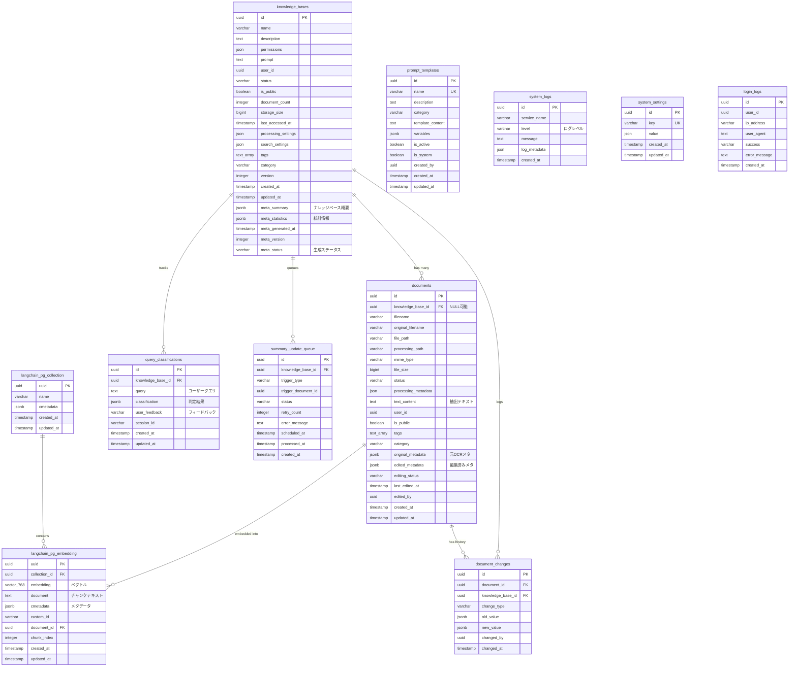

# admindb ER図

最終更新: 2025-10-05

## 概要

admindbは、AI Micro Serviceシステムの管理機能を担当するデータベースです。ナレッジベース、ドキュメント管理、RAGベクトル検索、システムログ、メタクエリ分類機能を提供します。

## ER図



## テーブル一覧

### コアエンティティ

#### 1. knowledge_bases
ナレッジベースのメインテーブル。ドキュメントコレクションを管理。

**主要カラム**:
- `meta_summary` (jsonb): LLM生成のナレッジベース概要
  ```json
  {
    "overview": "このナレッジベースは...",
    "main_topics": ["トピック1", "トピック2"],
    "key_concepts": ["概念1", "概念2"],
    "content_types": {"PDF": 5, "DOCX": 3},
    "total_documents": 8,
    "total_pages": 120,
    "total_chunks": 450,
    "generated_at": "2025-10-05T12:00:00",
    "generation_duration": 15.5
  }
  ```
- `meta_statistics` (jsonb): 統計情報（meta_summaryから抽出）
- `meta_status`: `pending` | `processing` | `completed` | `failed`
- `prompt` (text): カスタムチャットプロンプト

**インデックス**:
- `idx_kb_meta_status`: サマリー生成ステータス検索用
- `idx_kb_meta_generated_at`: 生成日時検索用
- `idx_knowledge_bases_tags` (GIN): タグ検索用

#### 2. documents
ドキュメント管理テーブル。PDF、DOCX等のファイル情報とOCRメタデータ。

**主要カラム**:
- `knowledge_base_id` (uuid, NULL可): ナレッジベースID（NULLの場合スタンドアロン文書）
- `text_content` (text): Doclingで抽出したテキスト
- `original_metadata` (jsonb): Docling処理の元OCRメタデータ
  ```json
  {
    "pages": [
      {
        "page_number": 1,
        "hierarchical_elements": [
          {
            "id": "ID-1",
            "type": "title",
            "text": "タイトル",
            "bbox": {"x": 100, "y": 200, "width": 400, "height": 50}
          }
        ]
      }
    ]
  }
  ```
- `edited_metadata` (jsonb): ユーザー編集後のOCRメタデータ
- `editing_status`: `unedited` | `edited` | `approved`
- `status`: `uploaded` | `processing` | `processed` | `failed`

**制約**:
- `check_owner`: `knowledge_base_id` IS NOT NULL OR `user_id` IS NOT NULL

**インデックス**:
- `idx_documents_kb_id`: ナレッジベース検索用
- `idx_documents_editing_status`: 編集ステータス検索用
- `idx_documents_tags` (GIN): タグ検索用

### RAG/ベクトル検索

#### 3. langchain_pg_embedding
ベクトル埋め込みテーブル。ドキュメントチャンクのベクトル表現。

**主要カラム**:
- `embedding` (vector(768)): OpenAI text-embedding-3-small (768次元)
- `document` (text): チャンクのテキスト内容
- `cmetadata` (jsonb): メタデータ
  ```json
  {
    "knowledge_base_id": "uuid",
    "document_id": "uuid",
    "filename": "example.pdf",
    "page_number": 1,
    "chunk_type": "text"
  }
  ```
- `document_id` (uuid, FK): 元ドキュメント
- `chunk_index` (integer): ドキュメント内でのチャンク順序

**インデックス**:
- `langchain_pg_embedding_document_id_idx`: ドキュメントごとのチャンク検索用

#### 4. langchain_pg_collection
ベクトルコレクション。ナレッジベースごとに`knowledge_base_{uuid}`形式で作成。

### メタクエリ・AI機能

#### 5. query_classifications
クエリ意図判定ログ。メタクエリか通常クエリかの判定結果を保存。

**主要カラム**:
- `query` (text): ユーザーの入力クエリ
- `classification` (jsonb): LLM判定結果
  ```json
  {
    "is_meta_query": true,
    "confidence": 0.95,
    "query_type": "summary",
    "needs_clarification": false,
    "reasoning": "判定理由",
    "suggested_actions": ["action1", "action2"]
  }
  ```
- `user_feedback`: `correct` | `incorrect` | NULL（学習用フィードバック）
- `session_id`: セッショントラッキング用

**インデックス**:
- `idx_qc_kb_id`: ナレッジベースごとの分類履歴検索
- `idx_qc_created_at`: 時系列分析用

#### 6. prompt_templates
プロンプトテンプレート管理。チャット用のカスタマイズ可能なプロンプト。

**主要カラム**:
- `template_content` (text): プロンプトテンプレート本文
- `variables` (jsonb): 変数リスト（例: `["context", "query"]`）
- `is_system` (boolean): システムテンプレートフラグ
- `is_active` (boolean): 有効/無効

**制約**:
- `prompt_templates_template_content_check`: `{context}`と`{query}`の存在チェック

**インデックス**:
- `prompt_templates_name_key` (UNIQUE): テンプレート名一意制約

### 監査・履歴

#### 7. document_changes
ドキュメント変更履歴。OCR編集の監査ログ。

**主要カラム**:
- `change_type` (varchar): 変更タイプ（例: `metadata_update`, `text_edit`）
- `old_value` (jsonb): 変更前の値
- `new_value` (jsonb): 変更後の値
- `changed_by` (uuid): 編集者のユーザーID

#### 8. summary_update_queue
サマリー更新キュー。ドキュメント追加時の自動サマリー更新用（将来実装）。

**主要カラム**:
- `trigger_type` (varchar): `document_added` | `document_updated` | `document_deleted`
- `trigger_document_id` (uuid): トリガーとなったドキュメント
- `status`: `pending` | `processing` | `completed` | `failed`
- `retry_count` (integer): リトライ回数

### システム管理

#### 9. system_logs
システムログ。各マイクロサービスのログを集約。

**主要カラム**:
- `service_name`: サービス名（例: `ai-micro-api-admin`）
- `level`: `DEBUG` | `INFO` | `WARNING` | `ERROR` | `CRITICAL`
- `log_metadata` (json): 追加ログデータ

**インデックス**:
- `idx_system_logs_service`: サービス別ログ検索
- `idx_system_logs_level`: レベル別ログ検索
- `idx_system_logs_created_at`: 時系列ログ検索

#### 10. system_settings
システム設定。キー・バリュー形式の設定管理。

**制約**:
- `system_settings_key_key` (UNIQUE): キー一意制約

#### 11. login_logs
ログインログ。管理者ログイン履歴。

**主要カラム**:
- `success`: `'true'` | `'false'` (文字列型)
- `ip_address`: クライアントIPアドレス
- `user_agent`: ブラウザ情報

## 主要リレーションシップ

### 1対多リレーション

| 親テーブル | 子テーブル | 関係 | 削除時動作 |
|-----------|-----------|------|-----------|
| `knowledge_bases` | `documents` | 1:N | CASCADE |
| `knowledge_bases` | `query_classifications` | 1:N | CASCADE |
| `knowledge_bases` | `summary_update_queue` | 1:N | CASCADE |
| `knowledge_bases` | `document_changes` | 1:N | CASCADE |
| `documents` | `langchain_pg_embedding` | 1:N | CASCADE |
| `documents` | `document_changes` | 1:N | CASCADE |
| `langchain_pg_collection` | `langchain_pg_embedding` | 1:N | CASCADE |

### 重要な外部キー制約

```sql
-- ナレッジベース削除時、関連ドキュメントも削除
ALTER TABLE documents
ADD CONSTRAINT documents_knowledge_base_id_fkey
FOREIGN KEY (knowledge_base_id)
REFERENCES knowledge_bases(id) ON DELETE CASCADE;

-- ドキュメント削除時、関連ベクトル埋め込みも削除
ALTER TABLE langchain_pg_embedding
ADD CONSTRAINT langchain_pg_embedding_document_id_fkey
FOREIGN KEY (document_id)
REFERENCES documents(id) ON DELETE CASCADE;

-- ナレッジベース削除時、クエリ分類履歴も削除
ALTER TABLE query_classifications
ADD CONSTRAINT query_classifications_knowledge_base_id_fkey
FOREIGN KEY (knowledge_base_id)
REFERENCES knowledge_bases(id) ON DELETE CASCADE;
```

## 典型的なクエリパターン

### 1. ナレッジベースのサマリー取得

```sql
SELECT
    id,
    name,
    meta_summary,
    meta_statistics,
    meta_generated_at,
    meta_version,
    meta_status
FROM knowledge_bases
WHERE id = :kb_id;
```

### 2. ナレッジベースのドキュメント一覧

```sql
SELECT
    d.id,
    d.filename,
    d.original_filename,
    d.status,
    d.file_size,
    d.created_at,
    COUNT(e.uuid) as embedding_count
FROM documents d
LEFT JOIN langchain_pg_embedding e ON d.id = e.document_id
WHERE d.knowledge_base_id = :kb_id
GROUP BY d.id
ORDER BY d.created_at DESC;
```

### 3. ベクトル検索（コサイン類似度）

```sql
SELECT
    e.uuid,
    e.document,
    e.cmetadata,
    1 - (e.embedding <=> :query_vector) as similarity
FROM langchain_pg_embedding e
WHERE e.cmetadata->>'knowledge_base_id' = :kb_id
  AND 1 - (e.embedding <=> :query_vector) > :threshold
ORDER BY e.embedding <=> :query_vector
LIMIT :top_k;
```

### 4. クエリ分類履歴

```sql
SELECT
    id,
    query,
    classification,
    user_feedback,
    created_at
FROM query_classifications
WHERE knowledge_base_id = :kb_id
  AND created_at >= NOW() - INTERVAL '30 days'
ORDER BY created_at DESC
LIMIT 100;
```

### 5. ドキュメント変更履歴

```sql
SELECT
    dc.change_type,
    dc.old_value,
    dc.new_value,
    dc.changed_by,
    dc.changed_at,
    d.filename
FROM document_changes dc
JOIN documents d ON dc.document_id = d.id
WHERE dc.knowledge_base_id = :kb_id
ORDER BY dc.changed_at DESC
LIMIT 50;
```

## パフォーマンス最適化

### 推奨インデックス

すべて実装済み：

1. **ベクトル検索高速化**: pgvectorのIVFFlat/HNSWインデックス（将来的に検討）
2. **メタデータ検索**: GINインデックス（tags列に適用済み）
3. **時系列検索**: B-treeインデックス（created_at列に適用済み）
4. **外部キー**: すべての外部キー列にインデックス作成済み

### クエリ最適化のヒント

1. **ベクトル検索**:
   - `threshold`パラメータで結果を絞り込む
   - `LIMIT`を適切に設定（推奨: 5-20）

2. **メタデータ検索**:
   - JSONBパス演算子 `->>` を使用
   - 頻繁に検索するキーには部分インデックスを検討

3. **集計クエリ**:
   - `knowledge_bases.document_count` を活用（COUNT不要）
   - `meta_statistics` から統計情報を取得（再計算不要）

## データ整合性

### トリガー

```sql
-- updated_at自動更新トリガー
CREATE TRIGGER update_langchain_pg_embedding_updated_at
    BEFORE UPDATE ON langchain_pg_embedding
    FOR EACH ROW
    EXECUTE FUNCTION update_updated_at_column();
```

### 制約

1. **check_owner**: ドキュメントは必ずナレッジベースまたはユーザーに紐付く
2. **template_content_check**: プロンプトテンプレートに`{context}`と`{query}`必須
3. **user_feedback_check**: フィードバックは`correct`/`incorrect`/NULL のみ

## バックアップ戦略

推奨バックアップ対象（優先順位順）:

1. **knowledge_bases**: ナレッジベース設定とサマリー
2. **documents**: ドキュメントメタデータ（`edited_metadata`特に重要）
3. **langchain_pg_embedding**: ベクトルデータ（再生成可能だが時間がかかる）
4. **query_classifications**: 分類履歴（学習データとして重要）
5. **system_logs**: システムログ（トラブルシューティング用）

## マイグレーション履歴

- **Initial**: 基本テーブル作成
- **2025-09-01**: `meta_summary`, `meta_statistics`, `meta_status`カラム追加
- **2025-09-02**: `query_classifications`テーブル追加
- **2025-09-03**: `summary_update_queue`テーブル追加
- **2025-10-05**: 現在のスキーマ

## 関連ドキュメント

- [マイグレーション履歴](../migrations/)
- [API仕様書](../../01-api/)
- [データベース設計方針](../README.md)
