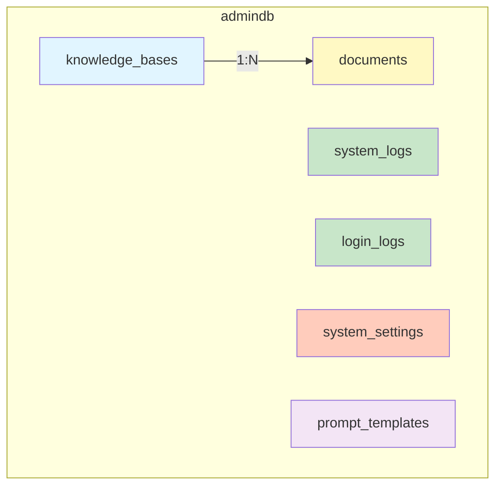

# admindb ER図（実装版）

**最終更新**: 2025-10-01
**基準**: ai-micro-api-admin/app/models/logs.py



## テーブル詳細

### 1. documents テーブル

**責務**: アップロードされたドキュメントの管理とOCRメタデータの保存

**主要カラム**:
- `id`: UUID型の主キー
- `knowledge_base_id`: knowledge_basesテーブルへの外部キー（NULL可）
- `filename`: ファイル名（インデックス付き）
- `original_filename`: 元のファイル名
- `file_path`: ファイルパス（500文字）
- `processing_path`: 処理パス（500文字、NULL可）
- `status`: 処理状態（デフォルト: 'uploaded'、インデックス付き）
- `original_metadata`: OCR元メタデータ（JSONB、NULL可）
- `edited_metadata`: 編集後メタデータ（JSONB、NULL可）
- `editing_status`: 編集状態（デフォルト: 'unedited'、インデックス付き）

**インデックス**:

```sql
CREATE INDEX idx_documents_filename ON documents(filename);
CREATE INDEX idx_documents_status ON documents(status);
CREATE INDEX idx_documents_user_id ON documents(user_id);
CREATE INDEX idx_documents_is_public ON documents(is_public);
CREATE INDEX idx_documents_category ON documents(category);
CREATE INDEX idx_documents_editing_status ON documents(editing_status);
CREATE INDEX idx_documents_edited_by ON documents(edited_by);
```

**外部キー**:

```sql
ALTER TABLE documents
    ADD CONSTRAINT fk_documents_knowledge_base
    FOREIGN KEY (knowledge_base_id) REFERENCES knowledge_bases(id) ON DELETE SET NULL;
```

### 2. knowledge_bases テーブル

**責務**: ナレッジベースの管理

**主要カラム**:
- `id`: UUID型の主キー
- `name`: 名前（255文字）
- `description`: 説明（TEXT、NULL可）
- `permissions`: 権限（JSON、デフォルト: []）
- `prompt`: プロンプト（TEXT、NULL可）
- `user_id`: ユーザーID（インデックス付き）
- `status`: 状態（デフォルト: 'active'、インデックス付き）
- `is_public`: 公開フラグ（デフォルト: False）
- `document_count`: ドキュメント数（デフォルト: 0）
- `storage_size`: ストレージサイズ（デフォルト: 0）

**インデックス**:

```sql
CREATE INDEX idx_knowledge_bases_user_id ON knowledge_bases(user_id);
CREATE INDEX idx_knowledge_bases_status ON knowledge_bases(status);
CREATE INDEX idx_knowledge_bases_category ON knowledge_bases(category);
```

### 3. system_logs テーブル

**責務**: システム全体のログ記録

**主要カラム**:
- `service_name`: サービス名（50文字、インデックス付き）
- `level`: ログレベル（10文字、インデックス付き）
- `message`: ログメッセージ（TEXT）
- `log_metadata`: ログメタデータ（JSON、NULL可）

**インデックス**:

```sql
CREATE INDEX idx_system_logs_service_name ON system_logs(service_name);
CREATE INDEX idx_system_logs_level ON system_logs(level);
CREATE INDEX idx_system_logs_created_at ON system_logs(created_at);
```

### 4. login_logs テーブル

**責務**: ユーザーログイン履歴の記録

**主要カラム**:
- `user_id`: ユーザーID（インデックス付き）
- `ip_address`: IPアドレス（45文字、IPv6対応、NULL可）
- `success`: 成功フラグ（デフォルト: 'true'）
- `error_message`: エラーメッセージ（TEXT、NULL可）

**インデックス**:

```sql
CREATE INDEX idx_login_logs_user_id ON login_logs(user_id);
CREATE INDEX idx_login_logs_created_at ON login_logs(created_at);
```

### 5. system_settings テーブル

**責務**: システム設定の管理

**主要カラム**:
- `key`: 設定キー（100文字、ユニーク、インデックス付き）
- `value`: 設定値（JSON）

**制約**:

```sql
ALTER TABLE system_settings
    ADD CONSTRAINT uk_system_settings_key UNIQUE (key);
CREATE INDEX idx_system_settings_key ON system_settings(key);
```

### 6. prompt_templates テーブル

**責務**: プロンプトテンプレートの管理

**主要カラム**:
- `name`: 名前（100文字、ユニーク、インデックス付き）
- `template_content`: テンプレート内容（TEXT）
- `variables`: 変数（JSONB、デフォルト: ["context", "query"]）
- `is_active`: アクティブフラグ（インデックス付き）
- `is_system`: システムフラグ（インデックス付き）

**制約**:

```sql
ALTER TABLE prompt_templates
    ADD CONSTRAINT uk_prompt_templates_name UNIQUE (name);
```

**インデックス**:

```sql
CREATE INDEX idx_prompt_templates_name ON prompt_templates(name);
CREATE INDEX idx_prompt_templates_category ON prompt_templates(category);
CREATE INDEX idx_prompt_templates_is_active ON prompt_templates(is_active);
CREATE INDEX idx_prompt_templates_is_system ON prompt_templates(is_system);
CREATE INDEX idx_prompt_templates_created_by ON prompt_templates(created_by);
```

## クエリ例

### documentsテーブル

```sql
-- ユーザーのドキュメント一覧
SELECT id, filename, status, file_size, created_at
FROM documents
WHERE user_id = '123e4567-e89b-12d3-a456-426614174000'
ORDER BY created_at DESC;

-- ナレッジベース内のドキュメント
SELECT d.id, d.filename, d.status, d.editing_status
FROM documents d
WHERE d.knowledge_base_id = 'kb-uuid-here'
ORDER BY d.created_at DESC;

-- 編集待ちドキュメント
SELECT id, filename, original_metadata, created_at
FROM documents
WHERE editing_status = 'unedited' AND original_metadata IS NOT NULL
ORDER BY created_at ASC
LIMIT 10;
```

### knowledge_basesテーブル

```sql
-- ユーザーのナレッジベース一覧
SELECT id, name, document_count, storage_size, status
FROM knowledge_bases
WHERE user_id = 'user-uuid-here' AND status = 'active'
ORDER BY last_accessed_at DESC NULLS LAST;

-- 公開ナレッジベース
SELECT id, name, description, document_count
FROM knowledge_bases
WHERE is_public = true AND status = 'active'
ORDER BY document_count DESC;
```

### system_logsテーブル

```sql
-- エラーログの確認
SELECT service_name, message, log_metadata, created_at
FROM system_logs
WHERE level = 'ERROR'
ORDER BY created_at DESC
LIMIT 50;

-- サービス別ログ統計
SELECT service_name, level, count(*) as count
FROM system_logs
WHERE created_at > NOW() - INTERVAL '24 hours'
GROUP BY service_name, level
ORDER BY service_name, level;
```

## カラム説明

### documentsテーブル

| カラム名 | 型 | 制約 | 説明 |
|---------|---|------|------|
| id | UUID | PK | 主キー |
| knowledge_base_id | UUID | FK, NULL | ナレッジベースID |
| filename | VARCHAR(255) | INDEX | ファイル名 |
| original_filename | VARCHAR(255) | | 元のファイル名 |
| file_path | VARCHAR(500) | | ファイルパス |
| processing_path | VARCHAR(500) | NULL | 処理パス |
| mime_type | VARCHAR(100) | | MIMEタイプ |
| file_size | BIGINT | | ファイルサイズ（バイト） |
| status | VARCHAR(20) | INDEX, DEFAULT 'uploaded' | 処理状態 |
| processing_metadata | JSON | NULL | 処理メタデータ |
| text_content | TEXT | NULL | テキストコンテンツ |
| user_id | UUID | INDEX, NULL | ユーザーID |
| is_public | BOOLEAN | INDEX | 公開フラグ |
| tags | ARRAY | | タグ配列 |
| category | VARCHAR(100) | INDEX, NULL | カテゴリ |
| original_metadata | JSONB | NULL | OCR元メタデータ |
| edited_metadata | JSONB | NULL | 編集後メタデータ |
| editing_status | VARCHAR(20) | INDEX, DEFAULT 'unedited' | 編集状態 |
| last_edited_at | TIMESTAMP | NULL | 最終編集日時 |
| edited_by | UUID | INDEX, NULL | 編集者ID |
| created_at | TIMESTAMP | | 作成日時 |
| updated_at | TIMESTAMP | | 更新日時 |

### knowledge_basesテーブル

| カラム名 | 型 | 制約 | 説明 |
|---------|---|------|------|
| id | UUID | PK | 主キー |
| name | VARCHAR(255) | | 名前 |
| description | TEXT | NULL | 説明 |
| permissions | JSON | DEFAULT [] | 権限 |
| prompt | TEXT | NULL | プロンプト |
| user_id | UUID | INDEX | ユーザーID |
| status | VARCHAR(20) | INDEX, DEFAULT 'active' | 状態 |
| is_public | BOOLEAN | DEFAULT false | 公開フラグ |
| document_count | INTEGER | DEFAULT 0 | ドキュメント数 |
| storage_size | BIGINT | DEFAULT 0 | ストレージサイズ |
| last_accessed_at | TIMESTAMP | NULL | 最終アクセス日時 |
| processing_settings | JSON | DEFAULT {} | 処理設定 |
| search_settings | JSON | DEFAULT {} | 検索設定 |
| tags | ARRAY | DEFAULT [] | タグ配列 |
| category | VARCHAR(100) | INDEX, NULL | カテゴリ |
| version | INTEGER | DEFAULT 1 | バージョン |
| created_at | TIMESTAMP | | 作成日時 |
| updated_at | TIMESTAMP | | 更新日時 |

---

## 注意事項

**実装基準**: このER図は実装コード（ai-micro-api-admin/app/models/logs.py）を基に作成されています。

**データベース構成**:
- PostgreSQL 15 with pgvector extension
- JSONB型を活用した柔軟なメタデータ管理
- 配列型（tags）を使用したタグ管理

**関連ドキュメント**:
- [データベース設計](../06-admindb-schema.md)
- [データベース構造全体図](./database-structure.md)
- [Admin API概要](../../03-admin-api/01-overview.md)
