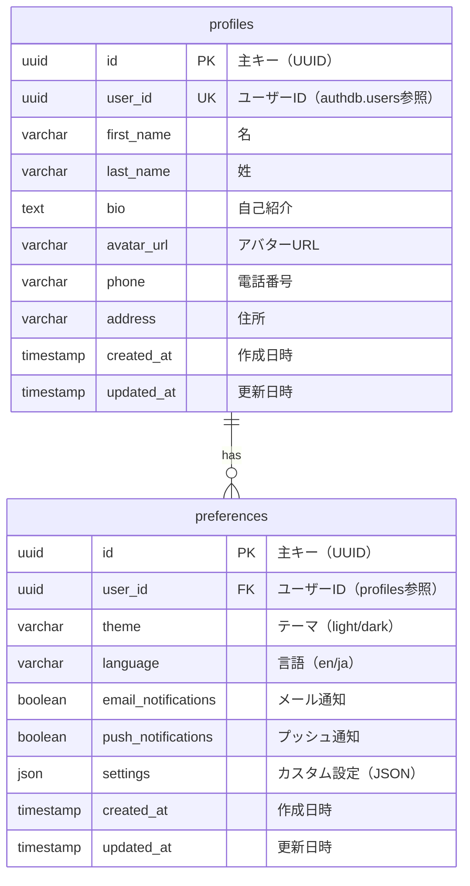

# apidb ER図



## テーブル詳細

### profiles テーブル

**責務**: ユーザープロファイル情報の管理

**主要カラム**:
- `id`: UUID型の主キー
- `user_id`: authdb.usersテーブルへの仮想外部キー（一意）
- `first_name`: ユーザーの名
- `last_name`: ユーザーの姓
- `bio`: 自己紹介文
- `avatar_url`: アバター画像のURL
- `phone`: 電話番号
- `address`: 住所

**インデックス**:

```sql
CREATE UNIQUE INDEX idx_profiles_user_id ON profiles(user_id);
CREATE INDEX idx_profiles_updated_at ON profiles(updated_at DESC);
CREATE INDEX idx_profiles_name ON profiles(first_name, last_name);
```

**制約**:

```sql
ALTER TABLE profiles
    ADD CONSTRAINT chk_phone_format CHECK (phone ~ '^\+?[0-9]{10,15}$' OR phone IS NULL),
    ADD CONSTRAINT chk_avatar_url CHECK (avatar_url ~* '^https?://' OR avatar_url IS NULL);
```

**クエリ例**:

```sql
-- ユーザープロファイルの取得
SELECT id, user_id, first_name, last_name, bio, avatar_url
FROM profiles
WHERE user_id = '123e4567-e89b-12d3-a456-426614174000';

-- プロファイルの更新
UPDATE profiles
SET first_name = 'John',
    last_name = 'Doe',
    bio = 'Software Engineer',
    updated_at = now()
WHERE user_id = '123e4567-e89b-12d3-a456-426614174000';

-- 最近更新されたプロファイル
SELECT user_id, first_name, last_name, updated_at
FROM profiles
WHERE updated_at > now() - interval '7 days'
ORDER BY updated_at DESC;

-- プロファイル完成度
SELECT
    user_id,
    CASE
        WHEN first_name IS NOT NULL AND last_name IS NOT NULL AND bio IS NOT NULL AND avatar_url IS NOT NULL
        THEN 'Complete'
        WHEN first_name IS NOT NULL OR last_name IS NOT NULL
        THEN 'Partial'
        ELSE 'Empty'
    END as completeness
FROM profiles;
```

### preferences テーブル

**責務**: ユーザー設定の管理

**主要カラム**:
- `id`: UUID型の主キー
- `user_id`: profilesテーブルへの外部キー
- `theme`: UIテーマ（light/dark）
- `language`: 表示言語（en/ja）
- `email_notifications`: メール通知の有効/無効
- `push_notifications`: プッシュ通知の有効/無効
- `settings`: カスタム設定（JSON）

**インデックス**:

```sql
CREATE UNIQUE INDEX idx_preferences_user_id ON preferences(user_id);
CREATE INDEX idx_preferences_theme ON preferences(theme);
CREATE INDEX idx_preferences_language ON preferences(language);
```

**制約**:

```sql
ALTER TABLE preferences
    ADD CONSTRAINT chk_theme CHECK (theme IN ('light', 'dark', 'auto')),
    ADD CONSTRAINT chk_language CHECK (language IN ('en', 'ja', 'zh', 'ko')),
    ADD CONSTRAINT fk_preferences_user FOREIGN KEY (user_id) REFERENCES profiles(user_id) ON DELETE CASCADE;
```

**クエリ例**:

```sql
-- ユーザー設定の取得
SELECT theme, language, email_notifications, push_notifications, settings
FROM preferences
WHERE user_id = '123e4567-e89b-12d3-a456-426614174000';

-- 設定の更新
UPDATE preferences
SET theme = 'dark',
    language = 'ja',
    updated_at = now()
WHERE user_id = '123e4567-e89b-12d3-a456-426614174000';

-- テーマ統計
SELECT theme, count(*) as user_count
FROM preferences
GROUP BY theme
ORDER BY user_count DESC;

-- 言語別ユーザー数
SELECT language, count(*) as user_count
FROM preferences
GROUP BY language
ORDER BY user_count DESC;

-- 通知設定統計
SELECT
    count(*) FILTER (WHERE email_notifications = true) as email_enabled,
    count(*) FILTER (WHERE push_notifications = true) as push_enabled,
    count(*) as total_users
FROM preferences;
```

## リレーション

### profiles → preferences (1:1)

- 1プロファイルが1つの設定を持つ
- ON DELETE CASCADE: プロファイル削除時に設定も削除
- user_idをFKとして使用

### profiles → authdb.users (仮想参照)

- 物理的な外部キーは存在しない
- アプリケーションレベルで整合性を管理
- user_idを通じて関連付け

## データ例

### profiles

```sql
INSERT INTO profiles VALUES (
    '223e4567-e89b-12d3-a456-426614174001',
    '123e4567-e89b-12d3-a456-426614174000',
    'John',
    'Doe',
    'Passionate software engineer with 10 years of experience.',
    'https://example.com/avatars/john_doe.jpg',
    '+81-90-1234-5678',
    'Tokyo, Japan',
    '2024-01-01 10:00:00',
    '2024-01-15 14:30:00'
);
```

### preferences

```sql
INSERT INTO preferences VALUES (
    '323e4567-e89b-12d3-a456-426614174002',
    '123e4567-e89b-12d3-a456-426614174000',
    'dark',
    'ja',
    true,
    false,
    '{"font_size": "medium", "sidebar_position": "left", "compact_mode": false}',
    '2024-01-01 10:00:00',
    '2024-01-15 14:30:00'
);
```

## キャッシュ戦略

### Redis キャッシュ

```
Key: profile:{user_id}
Value: {
    first_name: "John",
    last_name: "Doe",
    bio: "...",
    avatar_url: "https://...",
    theme: "dark",
    language: "ja"
}
TTL: 300秒（5分）
```

**キャッシュ更新戦略**:

```python
async def update_profile(user_id: str, data: dict):
    # 1. データベース更新
    await db.execute(
        "UPDATE profiles SET first_name=$1, last_name=$2, updated_at=now() WHERE user_id=$3",
        data["first_name"], data["last_name"], user_id
    )

    # 2. キャッシュ無効化
    await redis.delete(f"profile:{user_id}")

    # 3. イベント発行（他サービスへ通知）
    await redis.publish("profile:updated", json.dumps({
        "user_id": user_id,
        "updated_fields": list(data.keys())
    }))
```

## データ整合性

### authdb.users との整合性確認

```sql
-- 孤立プロファイル（authdbにユーザーが存在しない）
SELECT p.user_id, p.first_name, p.last_name
FROM profiles p
LEFT JOIN authdb.users u ON p.user_id = u.id
WHERE u.id IS NULL;

-- 不足プロファイル（authdbにユーザーが存在するがプロファイルがない）
SELECT u.id, u.username, u.email
FROM authdb.users u
LEFT JOIN profiles p ON u.id = p.user_id
WHERE p.user_id IS NULL
  AND u.is_active = true;
```

### Cron Job（毎日実行）

```python
@scheduler.scheduled_job("cron", hour=2)
async def check_profile_consistency():
    """プロファイル整合性チェック（毎日2時）"""

    # 1. authdbのアクティブユーザー取得
    active_users = await auth_db.fetch_all(
        "SELECT id FROM users WHERE is_active = true"
    )
    active_user_ids = {u["id"] for u in active_users}

    # 2. apidbのプロファイル取得
    profiles = await api_db.fetch_all("SELECT user_id FROM profiles")
    profile_user_ids = {p["user_id"] for p in profiles}

    # 3. 孤立プロファイル削除
    orphaned = profile_user_ids - active_user_ids
    if orphaned:
        logger.warning(f"Found {len(orphaned)} orphaned profiles")
        await api_db.execute(
            "DELETE FROM profiles WHERE user_id = ANY($1)",
            list(orphaned)
        )

    # 4. 不足プロファイル作成
    missing = active_user_ids - profile_user_ids
    if missing:
        logger.warning(f"Found {len(missing)} missing profiles")
        for user_id in missing:
            await api_db.execute(
                "INSERT INTO profiles (user_id) VALUES ($1) ON CONFLICT DO NOTHING",
                user_id
            )
            await api_db.execute(
                "INSERT INTO preferences (user_id) VALUES ($1) ON CONFLICT DO NOTHING",
                user_id
            )
```

## メンテナンス

### 定期クリーンアップ

```sql
-- 古いプロファイルのアーカイブ（非アクティブユーザー）
INSERT INTO profiles_archive
SELECT p.*
FROM profiles p
LEFT JOIN authdb.users u ON p.user_id = u.id
WHERE u.is_active = false
  OR u.id IS NULL;

-- アーカイブ後の削除
DELETE FROM profiles
WHERE user_id IN (
    SELECT p.user_id
    FROM profiles p
    LEFT JOIN authdb.users u ON p.user_id = u.id
    WHERE u.is_active = false
      OR u.id IS NULL
);
```

### バキューム

```sql
-- テーブルの最適化
VACUUM ANALYZE profiles;
VACUUM ANALYZE preferences;
```

## パフォーマンス最適化

### クエリ最適化

```sql
-- EXPLAIN ANALYZE でクエリプランを確認
EXPLAIN ANALYZE
SELECT p.*, pr.theme, pr.language
FROM profiles p
LEFT JOIN preferences pr ON p.user_id = pr.user_id
WHERE p.user_id = '123e4567-e89b-12d3-a456-426614174000';

-- インデックスの使用状況確認
SELECT schemaname, tablename, indexname, idx_scan, idx_tup_read, idx_tup_fetch
FROM pg_stat_user_indexes
WHERE tablename IN ('profiles', 'preferences')
ORDER BY idx_scan DESC;
```

---

**関連ドキュメント**:
- [データベース設計](../05-apidb-schema.md)
- [データベース構造全体図](./database-structure.md)
- [apidbスキーマ](../05-apidb-schema.md)
- [クロスデータベース関連](../08-cross-database-relations.md)