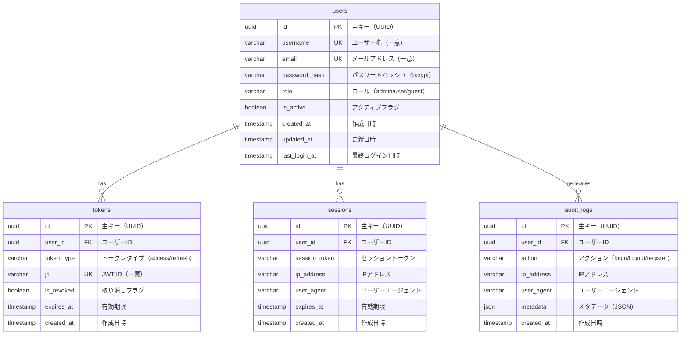

# authdb ER図



## テーブル詳細

### users テーブル

**責務**: ユーザー認証情報の管理

**主要カラム**:
- `id`: UUID型の主キー
- `username`: 一意のユーザー名（3-50文字）
- `email`: 一意のメールアドレス
- `password_hash`: bcryptでハッシュ化されたパスワード
- `role`: ユーザーロール（admin/user/guest）
- `is_active`: アカウントの有効/無効フラグ

**インデックス**:

```sql
CREATE INDEX idx_users_email ON users(email);
CREATE INDEX idx_users_username ON users(username);
CREATE INDEX idx_users_role ON users(role);
CREATE INDEX idx_users_is_active ON users(is_active);
CREATE INDEX idx_users_last_login ON users(last_login_at DESC);
```

**制約**:

```sql
ALTER TABLE users
    ADD CONSTRAINT chk_role CHECK (role IN ('admin', 'user', 'guest')),
    ADD CONSTRAINT chk_email_format CHECK (email ~* '^[A-Za-z0-9._%+-]+@[A-Za-z0-9.-]+\.[A-Z|a-z]{2,}$'),
    ADD CONSTRAINT chk_username_length CHECK (char_length(username) BETWEEN 3 AND 50);
```

**クエリ例**:

```sql
-- ユーザー認証
SELECT id, password_hash, role, is_active
FROM users
WHERE username = 'john_doe'
  AND is_active = true;

-- アクティブユーザー数
SELECT role, count(*)
FROM users
WHERE is_active = true
GROUP BY role;

-- 最近ログインしたユーザー
SELECT username, email, last_login_at
FROM users
WHERE last_login_at > now() - interval '30 days'
ORDER BY last_login_at DESC;
```

### tokens テーブル

**責務**: JWTトークンの履歴管理とブラックリスト

**主要カラム**:
- `id`: UUID型の主キー
- `user_id`: usersテーブルへの外部キー
- `token_type`: access または refresh
- `jti`: JWT ID（一意、ブラックリスト管理用）
- `is_revoked`: 取り消しフラグ
- `expires_at`: トークン有効期限

**インデックス**:

```sql
CREATE INDEX idx_tokens_user_id ON tokens(user_id);
CREATE INDEX idx_tokens_jti ON tokens(jti);
CREATE INDEX idx_tokens_expires_at ON tokens(expires_at);
CREATE INDEX idx_tokens_type_revoked ON tokens(token_type, is_revoked);
```

**用途**:
- JWTトークンの履歴管理
- ブラックリストとしても使用可能（is_revoked）
- 監査ログとして保存

**クエリ例**:

```sql
-- トークンのブラックリスト確認
SELECT id, is_revoked, expires_at
FROM tokens
WHERE jti = 'abc-123-def-456'
  AND expires_at > now();

-- ユーザーのアクティブトークン数
SELECT user_id, token_type, count(*)
FROM tokens
WHERE is_revoked = false
  AND expires_at > now()
GROUP BY user_id, token_type;

-- 期限切れトークンの削除
DELETE FROM tokens
WHERE expires_at < now() - interval '30 days';
```

### sessions テーブル

**責務**: アクティブセッションの管理

**主要カラム**:
- `id`: UUID型の主キー
- `user_id`: usersテーブルへの外部キー
- `session_token`: セッション識別子
- `ip_address`: ログイン元IPアドレス
- `user_agent`: ブラウザ情報
- `expires_at`: セッション有効期限

**インデックス**:

```sql
CREATE INDEX idx_sessions_user_id ON sessions(user_id);
CREATE INDEX idx_sessions_token ON sessions(session_token);
CREATE INDEX idx_sessions_expires_at ON sessions(expires_at);
CREATE INDEX idx_sessions_ip ON sessions(ip_address);
```

**用途**:
- アクティブセッション管理
- 同時ログイン管理
- セキュリティ監視

**クエリ例**:

```sql
-- ユーザーのアクティブセッション
SELECT session_token, ip_address, user_agent, created_at
FROM sessions
WHERE user_id = '123e4567-e89b-12d3-a456-426614174000'
  AND expires_at > now()
ORDER BY created_at DESC;

-- IPアドレスごとのセッション数
SELECT ip_address, count(*) as session_count
FROM sessions
WHERE expires_at > now()
GROUP BY ip_address
HAVING count(*) > 5
ORDER BY session_count DESC;

-- 期限切れセッションの削除
DELETE FROM sessions
WHERE expires_at < now() - interval '7 days';
```

### audit_logs テーブル

**責務**: 認証関連のセキュリティ監査ログ

**主要カラム**:
- `id`: UUID型の主キー
- `user_id`: usersテーブルへの外部キー
- `action`: 実行されたアクション
- `ip_address`: アクセス元IPアドレス
- `user_agent`: ブラウザ情報
- `metadata`: 追加情報（JSON）

**インデックス**:

```sql
CREATE INDEX idx_audit_user_id ON audit_logs(user_id);
CREATE INDEX idx_audit_action ON audit_logs(action);
CREATE INDEX idx_audit_created_at ON audit_logs(created_at DESC);
CREATE INDEX idx_audit_ip ON audit_logs(ip_address);
```

**用途**:
- セキュリティ監査
- ユーザー行動追跡
- インシデント調査

**クエリ例**:

```sql
-- ユーザーの最近のアクション
SELECT action, ip_address, created_at, metadata
FROM audit_logs
WHERE user_id = '123e4567-e89b-12d3-a456-426614174000'
ORDER BY created_at DESC
LIMIT 50;

-- 失敗したログイン試行
SELECT user_id, ip_address, count(*) as failed_attempts
FROM audit_logs
WHERE action = 'login_failed'
  AND created_at > now() - interval '1 hour'
GROUP BY user_id, ip_address
HAVING count(*) > 3;

-- アクション統計
SELECT action, count(*) as total
FROM audit_logs
WHERE created_at > now() - interval '24 hours'
GROUP BY action
ORDER BY total DESC;
```

## リレーション

### users → tokens (1:N)

- 1ユーザーが複数のトークンを持つ
- ログイン履歴として保存
- ON DELETE CASCADE: ユーザー削除時にトークンも削除

### users → sessions (1:N)

- 1ユーザーが複数のセッションを持つ
- 複数デバイスからのログインに対応
- ON DELETE CASCADE: ユーザー削除時にセッションも削除

### users → audit_logs (1:N)

- 1ユーザーが複数の監査ログを生成
- すべての認証関連アクションを記録
- ON DELETE SET NULL: ユーザー削除後もログは保持

## データ例

### users

```sql
INSERT INTO users VALUES (
    '123e4567-e89b-12d3-a456-426614174000',
    'john_doe',
    'john@example.com',
    '$2b$12$LQv3c1yqBWVHxkd0LHAkCOYz6TtxMQJqhN8/LeGN8sCk3fSKkM5W2',
    'user',
    true,
    '2024-01-01 10:00:00',
    '2024-01-01 10:00:00',
    '2024-01-15 09:30:00'
);
```

### tokens

```sql
INSERT INTO tokens VALUES (
    '223e4567-e89b-12d3-a456-426614174001',
    '123e4567-e89b-12d3-a456-426614174000',
    'access',
    'abc123-def456-ghi789',
    false,
    '2024-01-15 10:00:00',
    '2024-01-15 09:45:00'
);
```

### sessions

```sql
INSERT INTO sessions VALUES (
    '323e4567-e89b-12d3-a456-426614174002',
    '123e4567-e89b-12d3-a456-426614174000',
    'sess_abc123def456',
    '192.168.1.100',
    'Mozilla/5.0 (Macintosh; Intel Mac OS X 10_15_7)',
    '2024-01-15 10:45:00',
    '2024-01-15 09:45:00'
);
```

### audit_logs

```sql
INSERT INTO audit_logs VALUES (
    '423e4567-e89b-12d3-a456-426614174003',
    '123e4567-e89b-12d3-a456-426614174000',
    'login',
    '192.168.1.100',
    'Mozilla/5.0 (Macintosh; Intel Mac OS X 10_15_7)',
    '{"success": true, "method": "password"}',
    '2024-01-15 09:45:00'
);
```

## メンテナンス

### 定期クリーンアップ

```sql
-- 期限切れトークンの削除（毎日実行）
DELETE FROM tokens
WHERE expires_at < now() - interval '30 days';

-- 期限切れセッションの削除（毎日実行）
DELETE FROM sessions
WHERE expires_at < now() - interval '7 days';

-- 古い監査ログのアーカイブ（月次実行）
INSERT INTO audit_logs_archive
SELECT * FROM audit_logs
WHERE created_at < now() - interval '90 days';

DELETE FROM audit_logs
WHERE created_at < now() - interval '90 days';
```

### バキューム

```sql
-- テーブルの最適化
VACUUM ANALYZE users;
VACUUM ANALYZE tokens;
VACUUM ANALYZE sessions;
VACUUM ANALYZE audit_logs;
```

---

**関連ドキュメント**:
- [データベース設計](../04-authdb-schema.md)
- [データベース構造全体図](./database-structure.md)
- [authdbスキーマ](../04-authdb-schema.md)