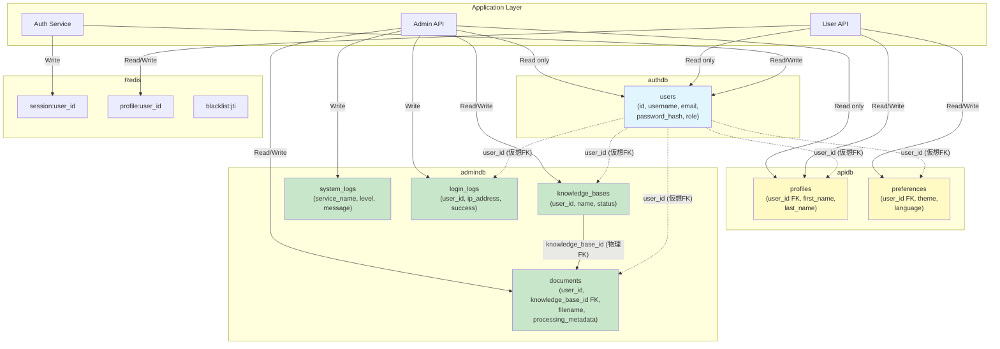

# クロスデータベース関連図



## 仮想外部キー (Virtual Foreign Keys)

### 概要

マイクロサービスアーキテクチャでは、データベース間の物理的な外部キー制約は使用せず、アプリケーションレベルで参照整合性を管理します。

### authdb.users → apidb.profiles

**関連**: 1対1

**参照方法**:

```python
# User API Service
async def get_profile(user_id: str):
    # 1. authdb.usersにユーザーが存在するか確認
    user = await auth_db.fetch_one(
        "SELECT id FROM users WHERE id = $1 AND is_active = true",
        user_id
    )
    if not user:
        raise HTTPException(404, "User not found")

    # 2. apidb.profilesから取得
    profile = await api_db.fetch_one(
        "SELECT * FROM profiles WHERE user_id = $1",
        user_id
    )
    return profile
```

**整合性保証**:
- ユーザー作成時に自動的にプロファイル作成
- Redis Pub/Subでイベント駆動同期
- 定期的な整合性チェックジョブ

### authdb.users → apidb.preferences

**関連**: 1対1

**参照方法**:

```python
async def get_preferences(user_id: str):
    # apidb.preferencesから取得
    prefs = await api_db.fetch_one(
        "SELECT * FROM preferences WHERE user_id = $1",
        user_id
    )

    if not prefs:
        # デフォルト設定を作成
        prefs = await api_db.fetch_one(
            """INSERT INTO preferences (user_id, theme, language)
               VALUES ($1, 'light', 'en')
               RETURNING *""",
            user_id
        )

    return prefs
```

### authdb.users → admindb.documents

**関連**: 1対多

**参照方法**:

```python
async def get_user_documents(user_id: str):
    # 1. authdb.usersにユーザーが存在するか確認
    user = await auth_db.fetch_one(
        "SELECT id FROM users WHERE id = $1 AND is_active = true",
        user_id
    )
    if not user:
        raise HTTPException(404, "User not found")

    # 2. admindb.documentsから取得
    documents = await admin_db.fetch_all(
        "SELECT * FROM documents WHERE user_id = $1 ORDER BY created_at DESC",
        user_id
    )
    return documents
```

### authdb.users → admindb.knowledge_bases

**関連**: 1対多

**参照方法**:

```python
async def get_user_knowledge_bases(user_id: str):
    # ユーザーのナレッジベース一覧を取得
    kbs = await admin_db.fetch_all(
        """SELECT * FROM knowledge_bases
           WHERE user_id = $1 AND status = 'active'
           ORDER BY last_accessed_at DESC NULLS LAST""",
        user_id
    )
    return kbs

async def create_knowledge_base(user_id: str, name: str, description: str = None):
    # 新規ナレッジベース作成
    kb = await admin_db.fetch_one(
        """INSERT INTO knowledge_bases (user_id, name, description, status, is_public)
           VALUES ($1, $2, $3, 'active', false)
           RETURNING *""",
        user_id, name, description
    )
    return kb
```

## イベント駆動データ同期

### ユーザー作成時

```python
# Auth Service
async def register_user(username: str, email: str, password: str):
    # 1. authdb.usersに登録
    user_id = await auth_db.execute(
        """INSERT INTO users (username, email, password_hash, role)
           VALUES ($1, $2, $3, 'user')
           RETURNING id""",
        username, email, hash_password(password)
    )

    # 2. イベント発行
    await redis.publish("user:created", json.dumps({
        "user_id": user_id,
        "username": username,
        "email": email,
        "timestamp": datetime.utcnow().isoformat()
    }))

    return user_id

# User API Service (Subscriber)
@event_handler("user:created")
async def on_user_created(event: dict):
    user_id = event["user_id"]

    # apidb.profilesに初期データ作成
    await api_db.execute(
        "INSERT INTO profiles (user_id) VALUES ($1) ON CONFLICT DO NOTHING",
        user_id
    )

    # apidb.preferencesにデフォルト設定作成
    await api_db.execute(
        """INSERT INTO preferences (user_id, theme, language)
           VALUES ($1, 'light', 'en') ON CONFLICT DO NOTHING""",
        user_id
    )

# Admin API Service (Subscriber)
@event_handler("user:created")
async def on_user_created(event: dict):
    user_id = event["user_id"]

    # admindb.user_quotasにデフォルトクォータ作成
    await admin_db.execute(
        """INSERT INTO user_quotas (user_id, document_limit, storage_limit)
           VALUES ($1, 100, 10737418240) ON CONFLICT DO NOTHING""",
        user_id
    )
```

### ユーザー無効化時

```python
# Auth Service
async def deactivate_user(user_id: str):
    # 1. authdb.usersを無効化
    await auth_db.execute(
        "UPDATE users SET is_active = false, updated_at = now() WHERE id = $1",
        user_id
    )

    # 2. セッションとトークンを無効化
    await redis.delete(f"session:{user_id}")
    await redis.set(f"blacklist:user:{user_id}", 1)

    # 3. イベント発行
    await redis.publish("user:deactivated", json.dumps({
        "user_id": user_id,
        "timestamp": datetime.utcnow().isoformat()
    }))

# User API Service (Subscriber)
@event_handler("user:deactivated")
async def on_user_deactivated(event: dict):
    user_id = event["user_id"]

    # キャッシュクリア
    await redis.delete(f"profile:{user_id}")

# Admin API Service (Subscriber)
@event_handler("user:deactivated")
async def on_user_deactivated(event: dict):
    user_id = event["user_id"]

    # ドキュメントのアーカイブ（削除はしない）
    await admin_db.execute(
        """UPDATE documents
           SET status = 'archived', updated_at = now()
           WHERE user_id = $1""",
        user_id
    )
```

## データ整合性チェック

### 定期チェックジョブ（毎日実行）

```python
@scheduler.scheduled_job("cron", hour=2)
async def check_cross_database_consistency():
    """クロスデータベース整合性チェック（毎日2時）"""

    # 1. authdb.usersのアクティブユーザー取得
    active_users = await auth_db.fetch_all(
        "SELECT id FROM users WHERE is_active = true"
    )
    active_user_ids = {u["id"] for u in active_users}

    # 2. apidb.profilesの整合性チェック
    profiles = await api_db.fetch_all("SELECT user_id FROM profiles")
    profile_user_ids = {p["user_id"] for p in profiles}

    # 孤立プロファイル削除
    orphaned_profiles = profile_user_ids - active_user_ids
    if orphaned_profiles:
        logger.warning(f"Found {len(orphaned_profiles)} orphaned profiles")
        await api_db.execute(
            "DELETE FROM profiles WHERE user_id = ANY($1)",
            list(orphaned_profiles)
        )

    # 不足プロファイル作成
    missing_profiles = active_user_ids - profile_user_ids
    if missing_profiles:
        logger.warning(f"Found {len(missing_profiles)} missing profiles")
        for user_id in missing_profiles:
            await api_db.execute(
                "INSERT INTO profiles (user_id) VALUES ($1) ON CONFLICT DO NOTHING",
                user_id
            )

    # 3. admindb.user_quotasの整合性チェック
    quotas = await admin_db.fetch_all("SELECT user_id FROM user_quotas")
    quota_user_ids = {q["user_id"] for q in quotas}

    # 孤立クォータ削除
    orphaned_quotas = quota_user_ids - active_user_ids
    if orphaned_quotas:
        logger.warning(f"Found {len(orphaned_quotas)} orphaned quotas")
        await admin_db.execute(
            "DELETE FROM user_quotas WHERE user_id = ANY($1)",
            list(orphaned_quotas)
        )

    # 不足クォータ作成
    missing_quotas = active_user_ids - quota_user_ids
    if missing_quotas:
        logger.warning(f"Found {len(missing_quotas)} missing quotas")
        for user_id in missing_quotas:
            await admin_db.execute(
                """INSERT INTO user_quotas (user_id, document_limit, storage_limit)
                   VALUES ($1, 100, 10737418240) ON CONFLICT DO NOTHING""",
                user_id
            )

    # 4. admindb.documentsの孤立チェック
    documents = await admin_db.fetch_all("SELECT DISTINCT user_id FROM documents")
    document_user_ids = {d["user_id"] for d in documents}

    orphaned_documents = document_user_ids - active_user_ids
    if orphaned_documents:
        logger.warning(f"Found documents from {len(orphaned_documents)} inactive users")
        # アーカイブ処理（削除はしない）
        await admin_db.execute(
            """UPDATE documents
               SET status = 'archived', updated_at = now()
               WHERE user_id = ANY($1) AND status != 'archived'""",
            list(orphaned_documents)
        )
```

## クロスデータベースクエリ

### アプリケーションレイヤーでのJOIN

```python
async def get_user_dashboard(user_id: str):
    """ユーザーダッシュボード情報を複数DBから取得"""

    # 並列実行で各DBから取得
    auth_data, profile_data, quota_data, documents_data = await asyncio.gather(
        auth_db.fetch_one(
            "SELECT username, email, role, last_login_at FROM users WHERE id = $1",
            user_id
        ),
        api_db.fetch_one(
            "SELECT first_name, last_name, bio FROM profiles WHERE user_id = $1",
            user_id
        ),
        admin_db.fetch_one(
            """SELECT document_limit, documents_uploaded, storage_limit, storage_used
               FROM user_quotas WHERE user_id = $1""",
            user_id
        ),
        admin_db.fetch_all(
            """SELECT id, filename, status, created_at
               FROM documents WHERE user_id = $1
               ORDER BY created_at DESC LIMIT 10""",
            user_id
        )
    )

    # 結果を統合
    return {
        "user": {
            "username": auth_data["username"],
            "email": auth_data["email"],
            "role": auth_data["role"],
            "last_login": auth_data["last_login_at"]
        },
        "profile": {
            "first_name": profile_data["first_name"],
            "last_name": profile_data["last_name"],
            "bio": profile_data["bio"]
        },
        "quota": {
            "documents": {
                "used": quota_data["documents_uploaded"],
                "limit": quota_data["document_limit"]
            },
            "storage": {
                "used": quota_data["storage_used"],
                "limit": quota_data["storage_limit"]
            }
        },
        "recent_documents": [
            {
                "id": doc["id"],
                "filename": doc["filename"],
                "status": doc["status"],
                "created_at": doc["created_at"]
            }
            for doc in documents_data
        ]
    }
```

## ベストプラクティス

### DO ✅

1. **イベント駆動でデータ同期**
   - Redis Pub/Subでリアルタイム同期
   - 非同期処理で影響を最小化

2. **定期的な整合性チェック**
   - Cronジョブで日次チェック
   - 不整合を自動修復

3. **キャッシュ活用**
   - Redisでクロスデータベースクエリの結果をキャッシュ
   - TTLを適切に設定

4. **並列クエリ**
   - asyncio.gatherで複数DBへの同時アクセス
   - レスポンス時間を短縮

5. **冪等性の確保**
   - ON CONFLICT DO NOTHINGで重複防止
   - イベントの再処理に対応

### DON'T ❌

1. **物理的な外部キー制約を使用**
   - データベース間では絶対に使用しない
   - スケーラビリティとメンテナンス性が低下

2. **分散トランザクション**
   - 2フェーズコミット等は使用しない
   - 複雑性とパフォーマンスの問題

3. **同期的なデータコピー**
   - APIリクエスト中に他DBへ同期書き込み
   - レスポンス時間が増加

4. **カスケード削除**
   - データベース間では実装しない
   - イベント駆動で個別に処理

## モニタリング

### 整合性チェックメトリクス

```python
# Prometheus メトリクス
from prometheus_client import Counter, Gauge

orphaned_records = Gauge(
    'cross_db_orphaned_records',
    'Number of orphaned records found',
    ['database', 'table']
)

missing_records = Gauge(
    'cross_db_missing_records',
    'Number of missing records found',
    ['database', 'table']
)

sync_errors = Counter(
    'cross_db_sync_errors',
    'Number of cross-database sync errors',
    ['event_type']
)
```

---

**関連ドキュメント**:
- [データベース設計](../01-overview.md)
- [データベース構造全体図](./database-structure.md)
- [データ整合性](../../08-integration/05-data-consistency.md)
- [Redis Pub/Sub](../../07-redis/02-data-structure-overview.md)