# データベース構造全体図

```mermaid
graph TB
    subgraph "PostgreSQL Container (Port 5432)"
        subgraph "authdb - 認証データベース"
            authUsers[users<br/>認証情報]
            authTokens[tokens<br/>トークン履歴]
            authSessions[sessions<br/>セッション管理]
            authAudit[audit_logs<br/>監査ログ]
        end

        subgraph "apidb - ユーザーAPIデータベース"
            apiProfiles[profiles<br/>プロファイル]
            apiPreferences[preferences<br/>設定]
        end

        subgraph "admindb - 管理APIデータベース"
            adminDocuments[documents<br/>ドキュメント]
            adminProcessing[processing_logs<br/>処理ログ]
            adminQuota[user_quotas<br/>クォータ管理]
        end
    end

    subgraph "Redis Container (Port 6379)"
        redisSession[Session Storage<br/>session:*]
        redisCache[Cache Layer<br/>profile:*, jwks:*]
        redisBlacklist[Token Blacklist<br/>blacklist:*]
        redisPubSub[Pub/Sub Messaging<br/>user:created, etc]
    end

    subgraph "Application Services"
        AuthService[Auth Service<br/>:8002]
        UserService[User API<br/>:8001]
        AdminService[Admin API<br/>:8003]
    end

    %% Auth Service connections
    AuthService -->|Read/Write| authUsers
    AuthService -->|Write| authTokens
    AuthService -->|Write| authSessions
    AuthService -->|Write| authAudit
    AuthService -->|Session管理| redisSession
    AuthService -->|Blacklist管理| redisBlacklist
    AuthService -->|イベント発行| redisPubSub

    %% User Service connections
    UserService -->|Read/Write| apiProfiles
    UserService -->|Read/Write| apiPreferences
    UserService -->|キャッシュ| redisCache
    UserService -->|Read only| authUsers
    UserService -->|イベント購読| redisPubSub

    %% Admin Service connections
    AdminService -->|Read/Write| adminDocuments
    AdminService -->|Write| adminProcessing
    AdminService -->|Read/Write| adminQuota
    AdminService -->|Read only| authUsers
    AdminService -->|Read only| apiProfiles
    AdminService -->|キャッシュ| redisCache

    %% Cross-database virtual references (no FK)
    authUsers -.->|user_id 参照| apiProfiles
    authUsers -.->|user_id 参照| adminDocuments
    authUsers -.->|user_id 参照| adminQuota

    style authdb fill:#e1f5ff
    style apidb fill:#fff9c4
    style admindb fill:#c8e6c9
    style redisSession fill:#ffcdd2
    style redisCache fill:#ffecb3
    style redisBlacklist fill:#ffccbc
    style redisPubSub fill:#f8bbd0
```



## データベース概要

### authdb - 認証データベース

**責務**: ユーザー認証、トークン管理、セッション管理

**テーブル**:
- `users`: ユーザー認証情報（username, email, password_hash）
- `tokens`: JWTトークン履歴（access/refresh tokens）
- `sessions`: アクティブセッション管理
- `audit_logs`: 認証関連の監査ログ

**サイズ**: 中規模（~10万ユーザー想定）

**バックアップ**: 毎日フルバックアップ + 継続的WAL

### apidb - ユーザーAPIデータベース

**責務**: ユーザープロファイル、設定情報

**テーブル**:
- `profiles`: ユーザープロファイル（first_name, last_name, bio）
- `preferences`: ユーザー設定（theme, language）

**サイズ**: 中規模（usersテーブルと同サイズ）

**バックアップ**: 毎日フルバックアップ

### admindb - 管理APIデータベース

**責務**: ドキュメント管理、処理ログ、クォータ管理

**テーブル**:
- `documents`: アップロードされたドキュメント
- `processing_logs`: OCR処理ログ
- `user_quotas`: ユーザーごとのクォータ

**サイズ**: 大規模（ドキュメントメタデータのみ、実データはS3）

**バックアップ**: 毎日フルバックアップ + 継続的WAL

## データフロー

### 1. ユーザー登録フロー

```
1. Auth Service → authdb.users (INSERT)
2. Auth Service → Redis Pub/Sub (PUBLISH user:created)
3. User API (Subscribe) → apidb.profiles (INSERT)
4. Admin API (Subscribe) → admindb.user_quotas (INSERT)
```

### 2. ログインフロー

```
1. Auth Service → authdb.users (SELECT)
2. Auth Service → authdb.sessions (INSERT)
3. Auth Service → Redis (SET session:{user_id})
```

### 3. プロファイル更新フロー

```
1. User API → Redis (GET profile:{user_id})
   - キャッシュヒット → 返却
   - キャッシュミス ↓
2. User API → apidb.profiles (SELECT)
3. User API → Redis (SETEX profile:{user_id})
```

### 4. ドキュメントアップロードフロー

```
1. Admin API → admindb.documents (INSERT)
2. Admin API → admindb.user_quotas (UPDATE)
3. Admin API → S3 (PUT object)
4. Admin API → admindb.processing_logs (INSERT)
```

## クロスデータベース参照

### Virtual Foreign Keys

データベース間の物理的な外部キーは使用せず、アプリケーションレベルで整合性を管理：

```
authdb.users.id (UUID)
    ↓ (user_id参照 - 物理FK無し)
apidb.profiles.user_id
admindb.documents.user_id
admindb.user_quotas.user_id
```

**整合性確保方法**:
1. アプリケーションレベルでの検証
2. Redis Pub/Subによるイベント駆動同期
3. 定期的な整合性チェックジョブ（Cron）

## Redis データ構造

### Session Storage

```
Key: session:{user_id}
Value: {username, role, ip_address}
TTL: 3600秒（1時間）
```

### Cache Layer

```
Key: profile:{user_id}
Value: {first_name, last_name, bio, ...}
TTL: 300秒（5分）

Key: jwks:cache
Value: {keys: [...]}
TTL: 3600秒（1時間）
```

### Token Blacklist

```
Key: blacklist:{jti}
Value: 1
TTL: token有効期限まで
```

### Pub/Sub Channels

```
Channel: user:created
Channel: user:updated
Channel: user:deactivated
Channel: profile:updated
Channel: document:uploaded
```

## パフォーマンス特性

### 読み取りパフォーマンス

| 操作 | キャッシュあり | キャッシュなし |
|------|---------------|---------------|
| プロファイル取得 | ~5ms | ~50ms |
| JWT検証 | ~15ms | ~60ms |
| セッション確認 | ~5ms | ~30ms |

### 書き込みパフォーマンス

| 操作 | 平均時間 |
|------|---------|
| ユーザー登録 | ~100ms |
| ログイン | ~200ms |
| プロファイル更新 | ~50ms |
| ドキュメントアップロード | ~500ms |

## スケーリング戦略

### PostgreSQL

- **垂直スケール**: CPU/メモリ増強
- **水平スケール**: Read Replicaの追加
- **パーティショニング**: 大規模テーブルの分割

### Redis

- **垂直スケール**: メモリ増強
- **水平スケール**: Redis Clusterの導入
- **Sentinel**: 高可用性構成

## バックアップ戦略

### PostgreSQL

```bash
# 毎日 2:00 AM フルバックアップ
pg_dump authdb > backup/authdb_$(date +%Y%m%d).sql
pg_dump apidb > backup/apidb_$(date +%Y%m%d).sql
pg_dump admindb > backup/admindb_$(date +%Y%m%d).sql

# WAL アーカイブ（継続的）
archive_mode = on
archive_command = 'cp %p /backup/wal/%f'
```

### Redis

```bash
# RDBスナップショット（1時間ごと）
save 3600 1

# AOF（Append Only File）
appendonly yes
appendfsync everysec
```

## モニタリング指標

### PostgreSQL

- 接続数: `SELECT count(*) FROM pg_stat_activity`
- クエリ性能: `pg_stat_statements`
- テーブルサイズ: `pg_total_relation_size()`

### Redis

- メモリ使用量: `INFO memory`
- Hit率: `keyspace_hits / (keyspace_hits + keyspace_misses)`
- 接続数: `INFO clients`

---

**関連ドキュメント**:
- [データベース概要](../01-overview.md)
- [authdbスキーマ](../04-authdb-schema.md)
- [apidbスキーマ](../05-apidb-schema.md)
- [admindbスキーマ](../06-admindb-schema.md)
- [クロスデータベース関連](../08-cross-database-relations.md)