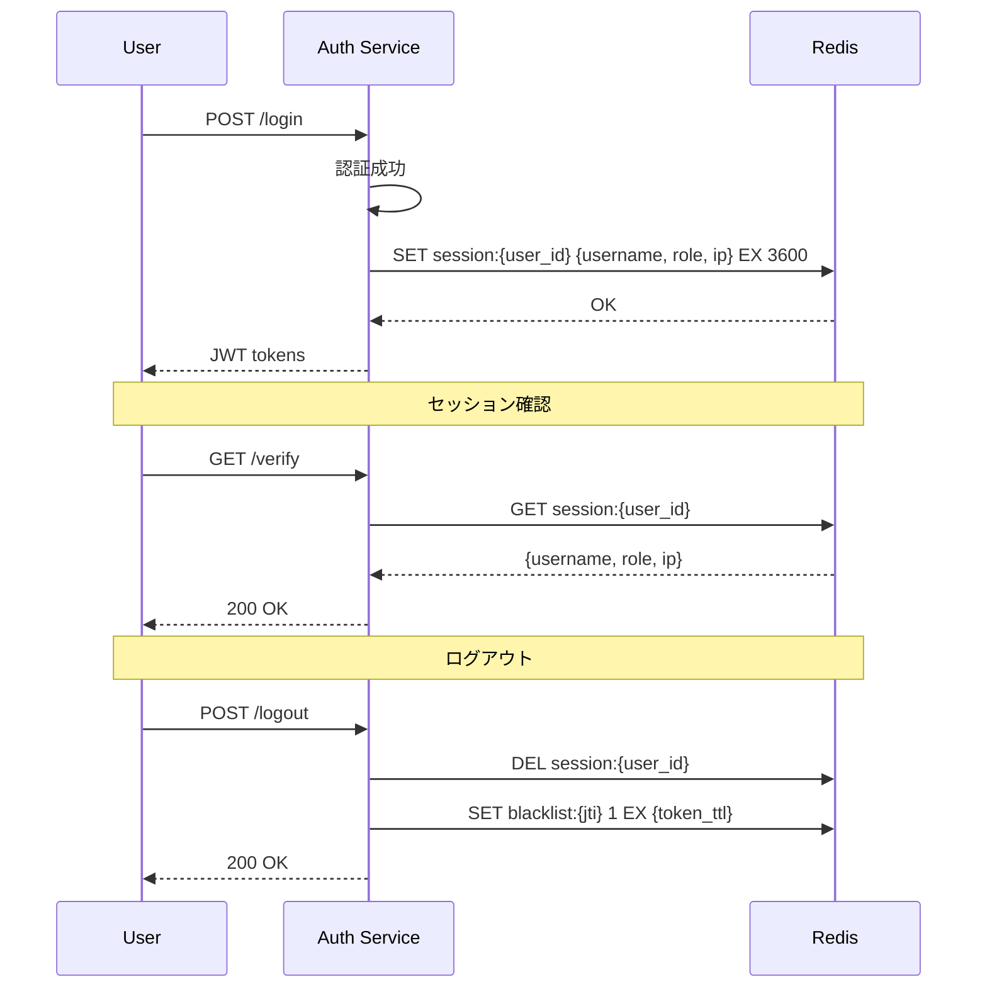
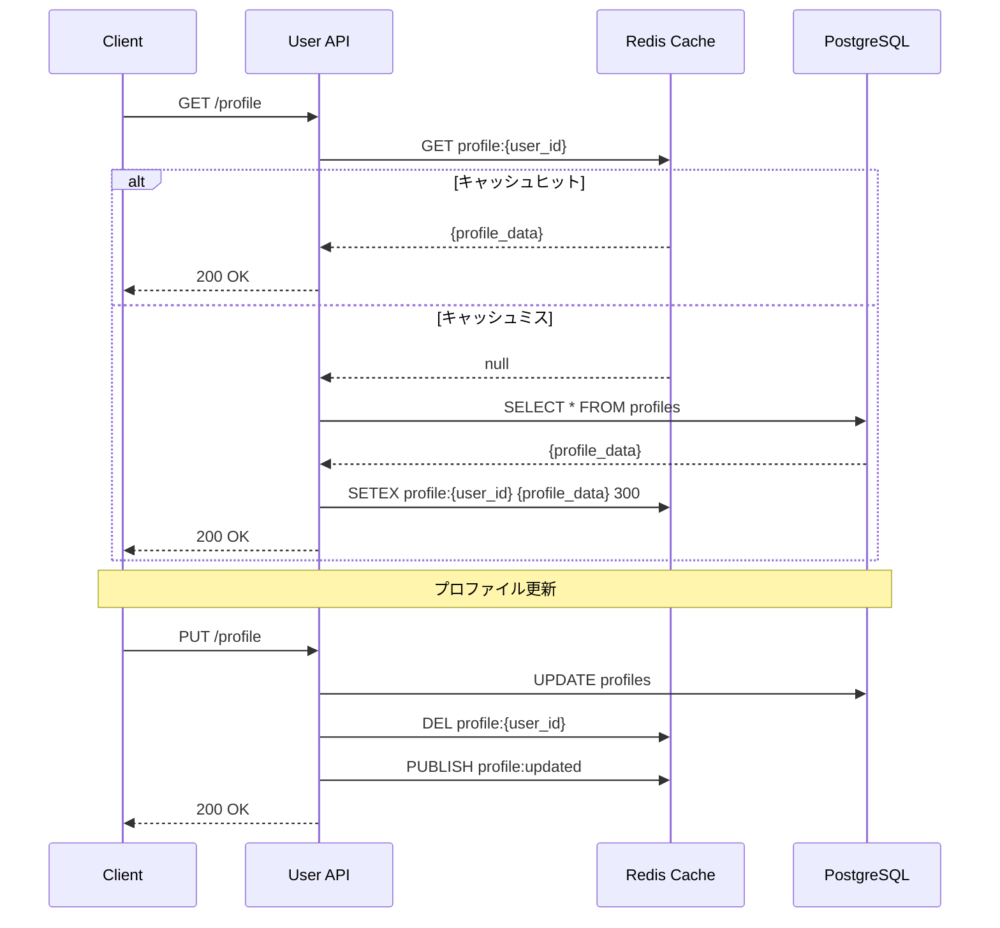
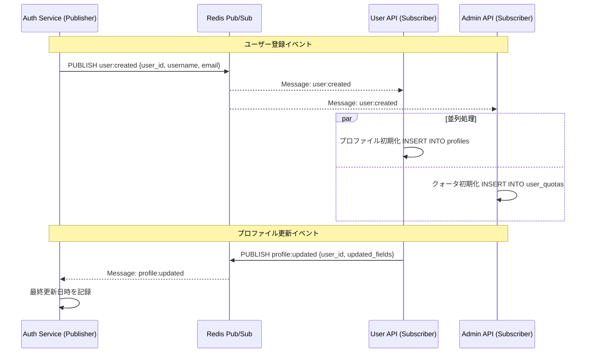
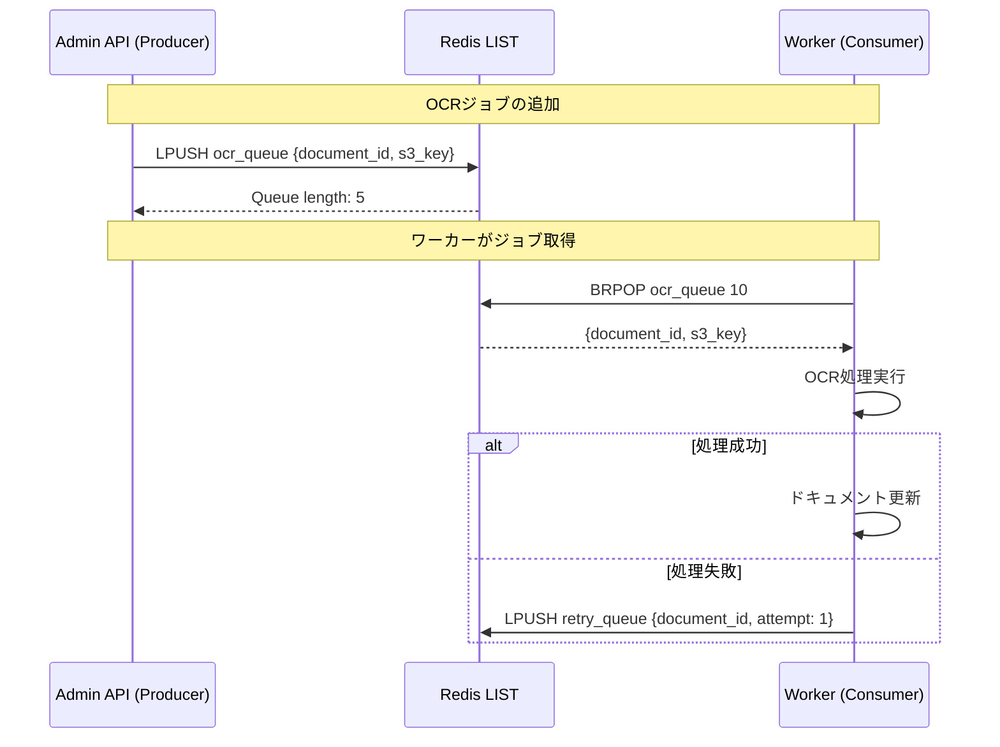
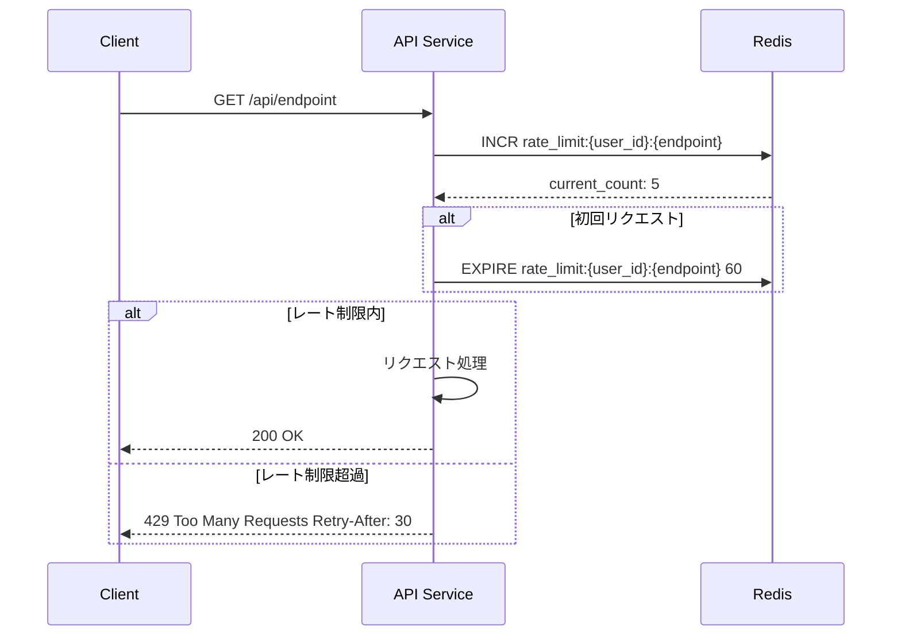

# Redis データフロー図

```mermaid
graph TB
    subgraph AppServices["Application Services"]
        AuthService["Auth Service :8002"]
        UserService["User API :8001"]
        AdminService["Admin API :8003"]
    end

    subgraph RedisData["Redis Data Structures"]
        subgraph SessionMgmt["Session Management"]
            Sessions["STRING: session:{user_id} TTL:3600s"]
        end

        subgraph TokenMgmt["Token Management"]
            Blacklist["STRING: blacklist:{jti} TTL:token_expiry"]
            JWKS["STRING: jwks:cache TTL:3600s"]
        end

        subgraph CacheLayer["Cache Layer"]
            ProfileCache["STRING: profile:{user_id} TTL:300s"]
            PrefsCache["STRING: preferences:{user_id} TTL:600s"]
        end

        subgraph PubSubMsg["Pub/Sub Messaging"]
            UserEvents["CHANNEL: user:created, user:updated, user:deactivated"]
            ProfileEvents["CHANNEL: profile:updated, profile:deleted"]
            DocumentEvents["CHANNEL: document:uploaded, document:processed"]
        end

        subgraph BgJobs["Background Jobs"]
            OcrQueue["LIST: ocr_queue LPUSH/BRPOP"]
            RetryQueue["LIST: retry_queue LPUSH/BRPOP"]
        end

        subgraph RateLimiting["Rate Limiting"]
            RateLimit["STRING: rate_limit:{user_id}:{endpoint} TTL:60s"]
        end
    end

    %% Auth Service connections
    AuthService -->|SET/GET/DEL| Sessions
    AuthService -->|SET| Blacklist
    AuthService -->|SET| JWKS
    AuthService -->|PUBLISH| UserEvents
    AuthService -->|INCR| RateLimit

    %% User Service connections
    UserService -->|GET| Sessions
    UserService -->|GET| JWKS
    UserService -->|SET/GET/DEL| ProfileCache
    UserService -->|SET/GET/DEL| PrefsCache
    UserService -->|SUBSCRIBE| UserEvents
    UserService -->|PUBLISH| ProfileEvents
    UserService -->|INCR| RateLimit

    %% Admin Service connections
    AdminService -->|GET| Sessions
    AdminService -->|GET| JWKS
    AdminService -->|GET| ProfileCache
    AdminService -->|LPUSH/BRPOP| OcrQueue
    AdminService -->|LPUSH/BRPOP| RetryQueue
    AdminService -->|PUBLISH| DocumentEvents
    AdminService -->|INCR| RateLimit

    style Sessions fill:#ffcdd2
    style Blacklist fill:#f8bbd0
    style JWKS fill:#e1bee7
    style ProfileCache fill:#c5cae9
    style PrefsCache fill:#bbdefb
    style UserEvents fill:#b2dfdb
    style ProfileEvents fill:#c8e6c9
    style DocumentEvents fill:#dcedc8
    style OcrQueue fill:#fff9c4
    style RetryQueue fill:#ffecb3
    style RateLimit fill:#ffccbc
```



## データ構造別フロー

### 1. セッション管理フロー



**実装例**:

```python
# セッション作成
async def create_session(user_id: str, user_data: dict) -> None:
    """セッション作成"""
    await redis.setex(
        f"session:{user_id}",
        3600,  # 1時間
        json.dumps({
            "username": user_data["username"],
            "role": user_data["role"],
            "ip_address": user_data["ip_address"],
            "created_at": datetime.utcnow().isoformat()
        })
    )

# セッション確認
async def get_session(user_id: str) -> dict:
    """セッション取得"""
    session = await redis.get(f"session:{user_id}")
    if not session:
        raise HTTPException(401, "Session expired")
    return json.loads(session)

# セッション削除
async def delete_session(user_id: str, jti: str, token_expiry: int) -> None:
    """セッション削除とトークンブラックリスト登録"""
    await redis.delete(f"session:{user_id}")
    await redis.setex(f"blacklist:{jti}", token_expiry, "1")
```

### 2. キャッシュフロー



**実装例**:

```python
# Cache-Aside Pattern
async def get_profile(user_id: str) -> dict:
    """プロファイル取得（キャッシュ優先）"""
    cache_key = f"profile:{user_id}"
    cached = await redis.get(cache_key)

    if cached:
        return json.loads(cached)

    # キャッシュミス - DBから取得
    profile = await db.fetch_one(
        "SELECT * FROM profiles WHERE user_id = $1",
        user_id
    )

    # キャッシュに保存
    await redis.setex(cache_key, 300, json.dumps(dict(profile)))

    return profile

# Write-Through Pattern
async def update_profile(user_id: str, data: dict) -> dict:
    """プロファイル更新（キャッシュ無効化）"""
    # DB更新
    profile = await db.fetch_one(
        """UPDATE profiles
           SET first_name=$1, last_name=$2, updated_at=now()
           WHERE user_id=$3
           RETURNING *""",
        data["first_name"], data["last_name"], user_id
    )

    # キャッシュ無効化
    await redis.delete(f"profile:{user_id}")

    # イベント発行
    await redis.publish("profile:updated", json.dumps({
        "user_id": user_id,
        "updated_fields": list(data.keys())
    }))

    return profile
```

### 3. Pub/Subフロー



**実装例**:

```python
# Publisher (Auth Service)
async def publish_user_created(user_id: str, username: str, email: str):
    """ユーザー作成イベント発行"""
    await redis.publish("user:created", json.dumps({
        "user_id": user_id,
        "username": username,
        "email": email,
        "timestamp": datetime.utcnow().isoformat()
    }))

# Subscriber (User API)
async def subscribe_user_events():
    """ユーザーイベント購読"""
    pubsub = redis.pubsub()
    await pubsub.subscribe("user:created", "user:updated", "user:deactivated")

    async for message in pubsub.listen():
        if message["type"] == "message":
            event = json.loads(message["data"])
            await handle_user_event(message["channel"], event)

async def handle_user_event(channel: str, event: dict):
    """イベントハンドラー"""
    if channel == "user:created":
        # プロファイル初期化
        await db.execute(
            "INSERT INTO profiles (user_id) VALUES ($1) ON CONFLICT DO NOTHING",
            event["user_id"]
        )
        await db.execute(
            "INSERT INTO preferences (user_id) VALUES ($1) ON CONFLICT DO NOTHING",
            event["user_id"]
        )
```

### 4. バックグラウンドジョブキュー



**実装例**:

```python
# Producer (Admin API)
async def enqueue_ocr_job(document_id: str, s3_key: str):
    """OCRジョブをキューに追加"""
    job = json.dumps({
        "document_id": document_id,
        "s3_key": s3_key,
        "enqueued_at": datetime.utcnow().isoformat()
    })

    queue_length = await redis.lpush("ocr_queue", job)
    logger.info(f"Enqueued OCR job for document {document_id}, queue length: {queue_length}")

# Consumer (Worker)
async def process_ocr_queue():
    """OCRキューを処理"""
    while True:
        # ブロッキングでジョブ取得（タイムアウト10秒）
        result = await redis.brpop("ocr_queue", timeout=10)

        if not result:
            continue

        queue_name, job_data = result
        job = json.loads(job_data)

        try:
            await process_ocr(job["document_id"], job["s3_key"])
        except Exception as e:
            logger.error(f"OCR failed: {e}")
            # リトライキューに追加
            await redis.lpush("retry_queue", json.dumps({
                **job,
                "attempt": job.get("attempt", 0) + 1,
                "error": str(e)
            }))
```

### 5. レート制限フロー



**実装例**:

```python
from fastapi import Request, HTTPException

async def rate_limit(request: Request, user_id: str, limit: int = 60):
    """レート制限（1分あたりのリクエスト数）"""

    # レート制限キー
    endpoint = request.url.path
    key = f"rate_limit:{user_id}:{endpoint}"

    # カウント増加
    current = await redis.incr(key)

    # 初回リクエストの場合はTTLを設定
    if current == 1:
        await redis.expire(key, 60)

    # レート制限チェック
    if current > limit:
        ttl = await redis.ttl(key)
        raise HTTPException(
            status_code=429,
            detail="Too many requests",
            headers={"Retry-After": str(ttl)}
        )

    return current

# エンドポイントで使用
@router.get("/profile")
async def get_profile(
    request: Request,
    current_user: User = Depends(get_current_user)
):
    await rate_limit(request, current_user.id, limit=60)
    return await profile_service.get(current_user.id)
```

## Redis コマンド一覧

### STRING操作

```redis
# セッション
SET session:{user_id} '{"username":"john","role":"user"}' EX 3600
GET session:{user_id}
DEL session:{user_id}

# キャッシュ
SETEX profile:{user_id} 300 '{"first_name":"John","last_name":"Doe"}'
GET profile:{user_id}

# ブラックリスト
SET blacklist:{jti} 1 EX 900
EXISTS blacklist:{jti}

# レート制限
INCR rate_limit:{user_id}:{endpoint}
EXPIRE rate_limit:{user_id}:{endpoint} 60
TTL rate_limit:{user_id}:{endpoint}
```

### LIST操作

```redis
# キューへ追加（左側）
LPUSH ocr_queue '{"document_id":"123","s3_key":"..."}'

# キューから取得（右側、ブロッキング）
BRPOP ocr_queue 10

# キューの長さ
LLEN ocr_queue

# キューの内容確認
LRANGE ocr_queue 0 -1
```

### Pub/Sub操作

```redis
# 購読
SUBSCRIBE user:created user:updated user:deactivated

# 発行
PUBLISH user:created '{"user_id":"123","username":"john"}'

# パターン購読
PSUBSCRIBE user:*
```

## モニタリング

### Redisメトリクス

```python
from prometheus_client import Counter, Gauge, Histogram

# Redis操作カウンター
redis_operations = Counter(
    'redis_operations_total',
    'Total Redis operations',
    ['operation', 'key_type']
)

# キャッシュヒット率
cache_hits = Counter('cache_hits_total', 'Cache hits', ['cache_type'])
cache_misses = Counter('cache_misses_total', 'Cache misses', ['cache_type'])

# Redis接続数
redis_connections = Gauge('redis_connections', 'Active Redis connections')

# レスポンス時間
redis_response_time = Histogram(
    'redis_response_seconds',
    'Redis response time',
    ['operation']
)
```

## ベストプラクティス

### DO ✅

1. **適切なTTL設定**
   - セッション: 1時間
   - キャッシュ: 5-10分
   - ブラックリスト: トークン有効期限

2. **接続プーリング**
   - 接続を再利用
   - max_connections設定

3. **エラーハンドリング**
   - Redis接続失敗時のフォールバック
   - タイムアウト設定

4. **モニタリング**
   - メモリ使用量監視
   - ヒット率追跡

### DON'T ❌

1. **大きなデータの保存**
   - 1MB以上のデータは避ける
   - 外部ストレージを使用

2. **TTL未設定**
   - メモリリークの原因
   - 必ずTTLを設定

3. **ブロッキング操作の乱用**
   - BRPOPのタイムアウト設定
   - 無限ループを避ける

---

**関連ドキュメント**:
- [Redis概要](../01-overview.md)
- [データ構造](../02-data-structure-overview.md)
- [キャッシュ戦略](../06-cache-strategy.md)