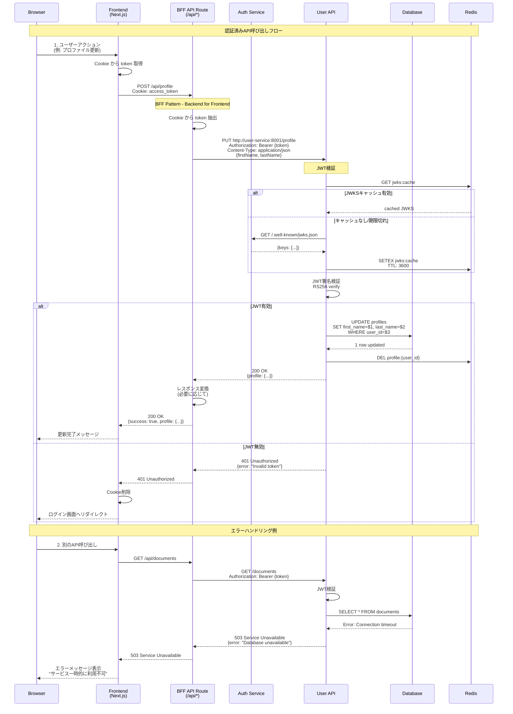

# API呼び出しシーケンス図



## BFF Pattern の役割

### 1. 認証情報の管理
- Cookie からトークン抽出
- Authorization ヘッダーに変換
- フロントエンドにトークンを公開しない

### 2. リクエスト変換
```typescript
// Frontend → BFF
POST /api/profile
Cookie: access_token=xxx

// BFF → Backend
PUT http://user-service:8001/profile
Authorization: Bearer xxx
```

### 3. レスポンス加工
```typescript
// Backend レスポンス
{
  id: "123",
  first_name: "John",
  last_name: "Doe"
}

// BFF が加工
{
  success: true,
  profile: {
    id: "123",
    firstName: "John",  // camelCase変換
    lastName: "Doe"
  }
}
```

### 4. エラーハンドリング
```typescript
// Backend エラー
{
  detail: "Invalid token"
}

// BFF が統一
{
  error: "認証エラー",
  message: "再ログインしてください",
  code: "AUTH_ERROR"
}
```

## JWT検証キャッシュ戦略

### JWKS キャッシュ
```
Redis Key: jwks:cache
TTL: 3600秒（1時間）
Value: {keys: [{kty, n, e, ...}]}
```

**メリット**:
- Auth Service への負荷軽減
- 検証速度向上（~50ms → ~5ms）

### JWT検証フロー
```
1. Redis から JWKS 取得 (5ms)
   ↓ キャッシュヒット
2. 署名検証 (10ms)
   ↓
3. 検証成功
-----------
合計: ~15ms
```

## エラーレスポンス

### 401 Unauthorized
```json
{
  "error": "UNAUTHORIZED",
  "message": "Invalid or expired token",
  "code": 401
}
```

### 403 Forbidden
```json
{
  "error": "FORBIDDEN",
  "message": "Insufficient permissions",
  "code": 403
}
```

### 503 Service Unavailable
```json
{
  "error": "SERVICE_UNAVAILABLE",
  "message": "Database connection failed",
  "code": 503
}
```

## パフォーマンス最適化

### 1. コネクションプーリング
```python
# Database
database = Database(url, min_size=10, max_size=20)

# Redis
redis_pool = ConnectionPool(max_connections=50)
```

### 2. キャッシュ活用
- JWKS: 1時間
- Profile: 5分
- Static data: 1日

### 3. 非同期処理
```python
# 並列処理
results = await asyncio.gather(
    get_profile(user_id),
    get_preferences(user_id),
    get_stats(user_id)
)
```

---

**関連ドキュメント**:
- [BFFパターン](../07-bff-pattern.md)
- [JWT検証フロー](./jwt-verification-flow.md)
- [エラー伝播](../06-error-propagation.md)