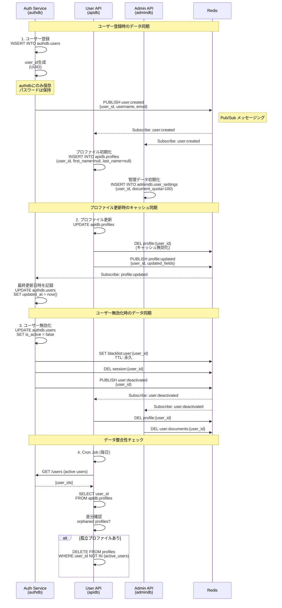

# データ同期フロー図



## データ同期パターン

### 1. Event-driven Sync (イベント駆動)

**Redis Pub/Sub使用**:

```python
# Publisher (Auth Service)
await redis.publish("user:created", json.dumps({
    "user_id": user_id,
    "username": username,
    "email": email,
    "timestamp": datetime.utcnow().isoformat()
}))

# Subscriber (User API)
pubsub = redis.pubsub()
pubsub.subscribe("user:created", "user:updated", "user:deactivated")

for message in pubsub.listen():
    if message["type"] == "message":
        event = json.loads(message["data"])
        await handle_event(event)
```

### 2. Cache Invalidation (キャッシュ無効化)

**Write-Through パターン**:

```python
async def update_profile(user_id: str, data: dict):
    # 1. データベース更新
    await db.execute(
        "UPDATE profiles SET first_name=$1, last_name=$2 WHERE user_id=$3",
        data["first_name"], data["last_name"], user_id
    )

    # 2. キャッシュ無効化
    await redis.delete(f"profile:{user_id}")

    # 3. イベント発行
    await redis.publish("profile:updated", json.dumps({
        "user_id": user_id,
        "updated_fields": list(data.keys())
    }))
```

### 3. Eventually Consistent (結果整合性)

**非同期同期**:

```python
# authdb で user_id を生成
user = await auth_db.insert_user(username, email, password_hash)

# 非同期で他のDBに同期（失敗してもOK）
background_tasks.add_task(sync_user_to_services, user.id)

async def sync_user_to_services(user_id: str):
    try:
        # User API
        await user_api.create_profile(user_id)
    except Exception as e:
        logger.error(f"Failed to sync to User API: {e}")
        # リトライキューに追加
        await retry_queue.push("sync_user_profile", user_id)

    try:
        # Admin API
        await admin_api.create_settings(user_id)
    except Exception as e:
        logger.error(f"Failed to sync to Admin API: {e}")
        await retry_queue.push("sync_admin_settings", user_id)
```

## データ整合性チェック

### Cron Job（毎日実行）

```python
@scheduler.scheduled_job("cron", hour=2)
async def check_data_consistency():
    """データ整合性チェック（毎日2時）"""

    # 1. authdb のアクティブユーザー取得
    active_users = await auth_db.fetch_all(
        "SELECT id FROM users WHERE is_active = true"
    )
    active_user_ids = {u["id"] for u in active_users}

    # 2. apidb のプロファイル取得
    profiles = await api_db.fetch_all("SELECT user_id FROM profiles")
    profile_user_ids = {p["user_id"] for p in profiles}

    # 3. 孤立プロファイル削除
    orphaned = profile_user_ids - active_user_ids
    if orphaned:
        logger.warning(f"Found {len(orphaned)} orphaned profiles")
        await api_db.execute(
            "DELETE FROM profiles WHERE user_id = ANY($1)",
            list(orphaned)
        )

    # 4. 不足プロファイル作成
    missing = active_user_ids - profile_user_ids
    if missing:
        logger.warning(f"Found {len(missing)} missing profiles")
        for user_id in missing:
            await api_db.execute(
                "INSERT INTO profiles (user_id) VALUES ($1)",
                user_id
            )
```

## イベント種類

| イベント | 発行元 | 購読者 | データ |
|---------|--------|--------|--------|
| `user:created` | Auth | User API, Admin API | user_id, username, email |
| `user:updated` | Auth | User API, Admin API | user_id, updated_fields |
| `user:deactivated` | Auth | User API, Admin API | user_id |
| `profile:updated` | User API | Auth | user_id, updated_fields |
| `document:uploaded` | Admin API | - | user_id, document_id |

## エラーハンドリング

### リトライキュー

```python
class RetryQueue:
    async def push(self, task_name: str, data: dict, max_retries: int = 3):
        """失敗したタスクをリトライキューに追加"""
        await redis.lpush("retry_queue", json.dumps({
            "task": task_name,
            "data": data,
            "attempts": 0,
            "max_retries": max_retries,
            "created_at": datetime.utcnow().isoformat()
        }))

    async def process(self):
        """リトライキューを処理"""
        while True:
            item = await redis.brpop("retry_queue", timeout=10)
            if not item:
                continue

            task = json.loads(item[1])

            try:
                await execute_task(task["task"], task["data"])
            except Exception as e:
                task["attempts"] += 1
                if task["attempts"] < task["max_retries"]:
                    # リトライ
                    await asyncio.sleep(2 ** task["attempts"])  # Exponential backoff
                    await self.push(task["task"], task["data"], task["max_retries"])
                else:
                    # 最大リトライ超過
                    logger.error(f"Task failed after {task['max_retries']} attempts: {task}")
```

## ベストプラクティス

### DO ✅
- イベント駆動で非同期に同期
- キャッシュ無効化を忘れずに
- 定期的な整合性チェック
- リトライメカニズム実装

### DON'T ❌
- 同期的なDB間コピー
- トランザクションまたぎ（分散トランザクション）
- キャッシュの長期保持（整合性リスク）

---

**関連ドキュメント**:
- [データ整合性](../05-data-consistency.md)
- [Redis Pub/Sub](../../07-redis/02-data-structure-overview.md)
- [クロスデータベース関連](../../06-database/08-cross-database-relations.md)