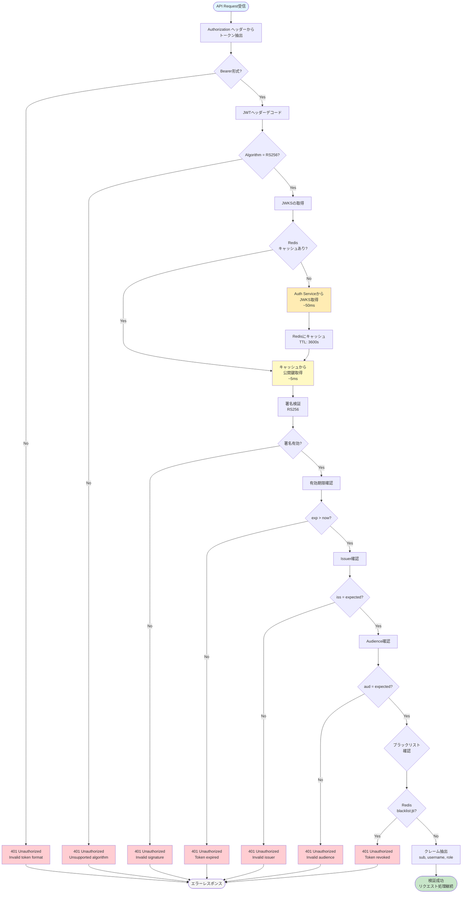

# JWT検証フロー図



## 検証ステップ詳細

### 1. トークン抽出 (1-2ms)
```python
auth_header = request.headers.get("Authorization")
if not auth_header or not auth_header.startswith("Bearer "):
    raise HTTPException(401, "Invalid authorization header")

token = auth_header.split(" ")[1]
```

### 2. ヘッダーデコード (1ms)
```python
header = jwt.get_unverified_header(token)
if header.get("alg") != "RS256":
    raise HTTPException(401, "Unsupported algorithm")
```

### 3. JWKS取得 (5-50ms)
```python
# Redisキャッシュ確認
jwks = await redis.get("jwks:cache")

if not jwks:
    # Auth Serviceから取得
    response = await httpx.get("http://auth-service:8002/.well-known/jwks.json")
    jwks = response.json()

    # Redisにキャッシュ（1時間）
    await redis.setex("jwks:cache", 3600, json.dumps(jwks))
```

### 4. 署名検証 (5-10ms)
```python
from jose import jwt, JWTError

try:
    payload = jwt.decode(
        token,
        jwks,
        algorithms=["RS256"],
        audience="fastapi-api",
        issuer="https://auth.example.com"
    )
except JWTError as e:
    raise HTTPException(401, f"Token validation failed: {str(e)}")
```

### 5. 有効期限確認 (1ms)
```python
import time

exp = payload.get("exp")
if not exp or exp < time.time():
    raise HTTPException(401, "Token expired")
```

### 6. ブラックリスト確認 (2-5ms)
```python
jti = payload.get("jti")
if await redis.exists(f"blacklist:{jti}"):
    raise HTTPException(401, "Token has been revoked")
```

### 7. クレーム抽出 (1ms)
```python
user_id = payload.get("sub")
username = payload.get("username")
role = payload.get("role")
```

## パフォーマンス

### キャッシュヒット時
```
合計時間: ~15ms
├─ トークン抽出: 1ms
├─ ヘッダー確認: 1ms
├─ JWKS取得: 5ms (Redis)
├─ 署名検証: 5ms
├─ 有効期限確認: 1ms
├─ ブラックリスト確認: 2ms
└─ クレーム抽出: 1ms
```

### キャッシュミス時
```
合計時間: ~60ms
├─ トークン抽出: 1ms
├─ ヘッダー確認: 1ms
├─ JWKS取得: 50ms (HTTP)
├─ 署名検証: 5ms
├─ 有効期限確認: 1ms
├─ ブラックリスト確認: 2ms
└─ クレーム抽出: 1ms
```

## エラーコード一覧

| エラー | ステータス | 原因 |
|-------|----------|------|
| Invalid token format | 401 | Bearer形式でない |
| Unsupported algorithm | 401 | RS256以外 |
| Invalid signature | 401 | 署名が一致しない |
| Token expired | 401 | 有効期限切れ |
| Invalid issuer | 401 | issが不一致 |
| Invalid audience | 401 | audが不一致 |
| Token revoked | 401 | ブラックリスト登録済み |

## 実装例

### FastAPI Dependency
```python
from fastapi import Depends, HTTPException
from fastapi.security import HTTPBearer

security = HTTPBearer()

async def get_current_user(
    credentials: HTTPAuthorizationCredentials = Depends(security)
) -> User:
    """JWT検証と現在のユーザー取得"""
    token = credentials.credentials

    # JWT検証フロー実行
    payload = await verify_jwt(token)

    user = User(
        id=payload["sub"],
        username=payload["username"],
        role=payload["role"]
    )

    return user

# エンドポイントで使用
@router.get("/profile")
async def get_profile(current_user: User = Depends(get_current_user)):
    return await profile_service.get(current_user.id)
```

### Redis キャッシュ管理
```python
# JWKS キャッシュ
JWKS_CACHE_KEY = "jwks:cache"
JWKS_CACHE_TTL = 3600  # 1時間

# ブラックリスト
BLACKLIST_KEY_PREFIX = "blacklist:"
BLACKLIST_TTL = token_expiry  # トークンの有効期限まで
```

---

**関連ドキュメント**:
- [JWT設計](../../01-auth-service/03-jwt-design.md)
- [認可フロー](../03-authorization-flow.md)
- [Redisキャッシュ戦略](../../07-redis/06-cache-strategy.md)