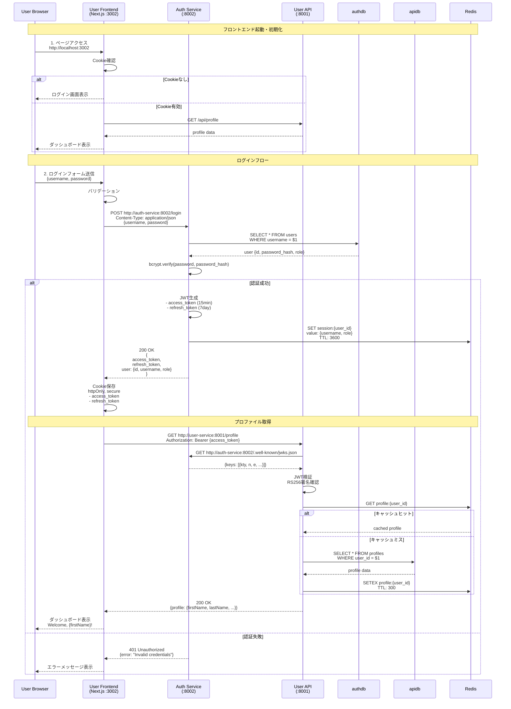

# ログインシーケンス図



## シーケンスの詳細

### 1. 初期アクセス (0-1秒)
- ブラウザがフロントエンドにアクセス
- Cookie確認で既存セッションをチェック
- 未ログインならログイン画面表示

### 2. ログイン処理 (1-2秒)
- **フロントエンド**: 入力バリデーション
- **Auth Service**: ユーザー認証、JWT生成
- **Redis**: セッション保存（1時間TTL）
- **フロントエンド**: JWT をhttpOnly Cookieに保存

### 3. JWT検証 (200-500ms)
- **User API**: Auth ServiceからJWKS取得
- **User API**: JWT署名検証（RS256）
- JWKSはキャッシュして再利用

### 4. プロファイル取得 (50-200ms)
- **Redis**: キャッシュ確認（5分TTL）
- キャッシュミス時のみDB検索
- 取得後はRedisにキャッシュ

## タイミング

```
ログインボタンクリック
    ↓ (100ms) バリデーション
Auth Service呼び出し
    ↓ (500ms) DB検索・JWT生成
JWT Cookie保存
    ↓ (50ms)
User API呼び出し
    ↓ (200ms) JWT検証・プロファイル取得
ダッシュボード表示
-----------
合計: ~850ms
```

## エラーハンドリング

### 認証エラー
```
401 Unauthorized → ログイン画面にリダイレクト
```

### タイムアウト
```
503 Service Unavailable → リトライまたはエラー表示
```

### ネットワークエラー
```
Network Error → オフライン表示
```

---

**関連ドキュメント**:
- [認証フロー統合](../02-authentication-flow.md)
- [サービス間通信](../01-service-communication.md)
- [JWT検証フロー](./jwt-verification-flow.md)