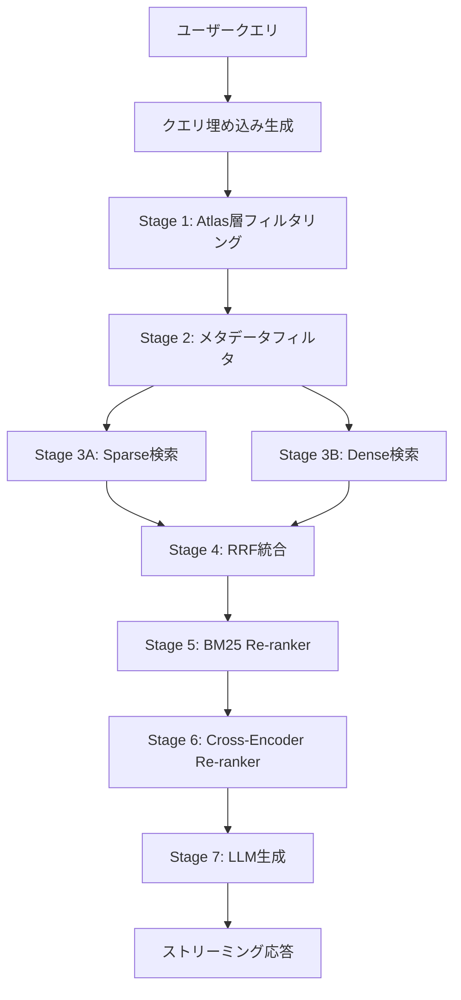

# RAGシステムアーキテクチャ

## 概要

エンタープライズRAGシステムは、7段階のパイプラインで構成される高精度な情報検索・生成システムです。Atlas層による事前フィルタリング、Sparse/Denseハイブリッド検索、Re-rankerによる精緻化、LLMによる自然な応答生成を組み合わせることで、エンタープライズ環境での高精度なRAGを実現します。

## 7段階パイプライン

### 全体フロー



### Stage 1: Atlas層フィルタリング

**目的**: KB/Collection要約ベクトルでクエリと関連性の高いKB/Collectionを事前選別

**処理内容**:

1. クエリベクトルと`knowledge_bases_summary_embedding`のコサイン類似度計算
2. 類似度上位2-3件のKBを選択（閾値: 0.7）
3. 選択されたKB内の`collections_summary_embedding`で同様に類似度計算
4. 最終的に2-3個のCollectionに絞り込み

**SQL例**:

```sql
SELECT kb.id, kb.name,
       1 - (kbse.summary_embedding <=> :query_vector) AS similarity
FROM knowledge_bases kb
JOIN knowledge_bases_summary_embedding kbse
  ON kb.id = kbse.knowledge_base_id
WHERE kbse.is_active = true
  AND kb.tenant_id = :tenant_id
ORDER BY kbse.summary_embedding <=> :query_vector
LIMIT 3;
```

**パフォーマンス目標**:

- レイテンシ: <50ms
- 精度: 95%+（関連KBを見逃さない）
- インデックス: HNSW (`idx_kb_summary_emb_hnsw`)

### Stage 2: メタデータフィルタ

**目的**: テナント・部署・機密レベルによるアクセス制御

**フィルタ条件**:

```python
filters = {
    "tenant_id": current_user.tenant_id,
    "knowledge_base_id": {"$in": selected_kb_ids},  # Stage 1結果
    "collection_id": {"$in": selected_collection_ids},  # Stage 1結果
    "department": current_user.department,  # 部署フィルタ
    "confidentiality": {"$lte": current_user.clearance_level}  # 機密レベル
}
```

**confidentiality階層**:

| レベル | 値 | アクセス権限 |
|-------|---|-----------|
| public | 1 | 全員 |
| internal | 2 | 社員のみ |
| confidential | 3 | 特定部署 |
| secret | 4 | 管理職以上 |
| top_secret | 5 | 経営層のみ |

### Stage 3A: Sparse検索（キーワードマッチング）

**目的**: 語彙ベースの高精度全文検索

**処理内容**:

1. クエリをPostgreSQL標準FTS（simple tokenizer）でトークン化
2. `document_fulltext`テーブルでPGroongaインデックス検索
3. BM25スコアリング（k1=1.5, b=0.75）
4. 上位500件を取得

**SQL例**:

```sql
SELECT df.document_id, df.chunk_index,
       ts_rank(to_tsvector('simple', df.content),
               plainto_tsquery('simple', :query)) AS bm25_score
FROM document_fulltext df
WHERE df.tenant_id = :tenant_id
  AND df.knowledge_base_id = ANY(:kb_ids)
  AND df.collection_id = ANY(:collection_ids)
  AND to_tsvector('simple', df.content) @@ plainto_tsquery('simple', :query)
ORDER BY bm25_score DESC
LIMIT 500;
```

**パフォーマンス目標**:

- レイテンシ: <200ms
- インデックス: GIN (`idx_document_fulltext_gin`)

### Stage 3B: Dense検索（意味検索）

**目的**: 埋め込みベクトル類似度による意味的検索

**処理内容**:

1. クエリベクトルと`langchain_pg_embedding`のコサイン類似度計算
2. PGVector HNSWインデックスで高速検索
3. 上位500件を取得

**SQL例**:

```sql
SELECT lpe.uuid, lpe.document_id, lpe.cmetadata->>'chunk_index' AS chunk_index,
       1 - (lpe.embedding <=> :query_vector) AS cosine_similarity
FROM langchain_pg_embedding lpe
WHERE lpe.tenant_id = :tenant_id
  AND lpe.document_id IN (
    SELECT d.id FROM documents d
    WHERE d.knowledge_base_id = ANY(:kb_ids)
      AND d.collection_id = ANY(:collection_ids)
  )
ORDER BY lpe.embedding <=> :query_vector
LIMIT 500;
```

**パフォーマンス目標**:

- レイテンシ: <300ms
- インデックス: HNSW (`idx_langchain_pg_embedding_hnsw`)

### Stage 4: RRF統合（Reciprocal Rank Fusion）

**目的**: Sparse/Dense検索結果を統合しランキング

**アルゴリズム**:

```
RRF_score(doc) = Σ [ 1 / (k + rank_i) ]

k = 60 (定数)
rank_i = Sparse/Dense検索での順位（1-indexed）
```

**実装例**:

```python
def reciprocal_rank_fusion(
    sparse_results: List[Tuple[str, float]],
    dense_results: List[Tuple[str, float]],
    k: int = 60
) -> List[Tuple[str, float]]:
    rrf_scores = defaultdict(float)

    # Sparse結果
    for rank, (doc_id, score) in enumerate(sparse_results, start=1):
        rrf_scores[doc_id] += 1 / (k + rank)

    # Dense結果
    for rank, (doc_id, score) in enumerate(dense_results, start=1):
        rrf_scores[doc_id] += 1 / (k + rank)

    # スコア降順でソート
    return sorted(rrf_scores.items(), key=lambda x: x[1], reverse=True)
```

**出力**: 上位600件（Re-ranker入力用）

### Stage 5: BM25 Re-ranker（粗Re-ranking）

**目的**: RRF結果をBM25で再評価し600件→100件に絞り込み

**処理内容**:

1. MeCab形態素解析でクエリ・ドキュメントをトークン化
2. rank-bm25ライブラリでBM25スコア計算
3. ハイブリッドスコア計算: `bm25_weight * bm25_score + vector_weight * rrf_score`
4. スコア上位100件を選択

**実装詳細**:
- ライブラリ: `rank-bm25` (BM25Okapi)
- トークナイザー: MeCab（名詞・動詞・形容詞抽出）
- デフォルト重み: bm25_weight=0.3, vector_weight=0.7
- 処理時間: ~150ms（600件処理）

**実装ステータス**: ✅ 実装済み（2025-11-06）

### Stage 6: Cross-Encoder Re-ranker（精密Re-ranking）

**目的**: Cross-Encoderモデルで100件→10件に精緻化

**処理内容**:

1. (クエリ, ドキュメント)ペアを作成
2. Cross-Encoderモデルでバッチ推論
3. 関連度スコアで降順ソート
4. 最終ランキング付与（1-indexed）
5. 上位10件を選択

**実装詳細**:
- モデル: `intfloat/multilingual-e5-large-instruct` (Microsoft製)
- 特徴: 多言語対応（日本語精度が高い）、最大512トークン
- バッチサイズ: CPU 16, GPU 64
- 処理時間: ~800ms（CPU）、~200ms（GPU）
- シングルトンパターン: プロセスごとに1インスタンス

**実装ステータス**: ✅ 実装済み（2025-11-06）

### Stage 7: LLM生成

**目的**: 検索結果を元に自然な応答を生成

**処理内容**:

1. 上位10件のチャンクをプロンプトに統合
2. gemma2:9bで応答生成
3. ストリーミング応答

**プロンプトテンプレート**:

```
あなたは企業向けナレッジベースアシスタントです。

# コンテキスト
{context}

# ユーザー質問
{query}

# 制約条件
- コンテキストに基づいて正確に回答してください
- 情報がない場合は「関連情報が見つかりませんでした」と明示してください
- 引用元（ドキュメント名）を明記してください

# 回答
```

## アーキテクチャ図

### システム構成

```
┌────────────────────────────────────────────────────────────┐
│                     フロントエンド                          │
│            (ai-micro-front-admin: Next.js)                 │
└────────────────────────────────────────────────────────────┘
                            │ HTTP REST API
                            ▼
┌────────────────────────────────────────────────────────────┐
│                      Admin API Service                      │
│              (ai-micro-api-admin: FastAPI)                 │
│                                                             │
│  ┌──────────────────────────────────────────────────────┐  │
│  │         HybridRetrieverService                       │  │
│  │  ┌──────────────┬──────────────┬──────────────┐    │  │
│  │  │ AtlasService │ SparseSearch │ VectorSearch │    │  │
│  │  └──────────────┴──────────────┴──────────────┘    │  │
│  └──────────────────────────────────────────────────────┘  │
└────────────────────────────────────────────────────────────┘
                            │
                            ▼
┌────────────────────────────────────────────────────────────┐
│                  PostgreSQL + pgvector                      │
│                         (admindb)                           │
│                                                             │
│  ┌──────────────────────────────────────────────────────┐  │
│  │ Atlas層                                              │  │
│  │ - knowledge_bases_summary_embedding                  │  │
│  │ - collections_summary_embedding                      │  │
│  │ - documents.centroid_embedding                       │  │
│  └──────────────────────────────────────────────────────┘  │
│                                                             │
│  ┌──────────────────────────────────────────────────────┐  │
│  │ Sparse層                                             │  │
│  │ - document_fulltext (PGroonga)                       │  │
│  └──────────────────────────────────────────────────────┘  │
│                                                             │
│  ┌──────────────────────────────────────────────────────┐  │
│  │ Dense層                                              │  │
│  │ - langchain_pg_embedding (PGVector HNSW)             │  │
│  └──────────────────────────────────────────────────────┘  │
└────────────────────────────────────────────────────────────┘
                            │
                            ▼
┌────────────────────────────────────────────────────────────┐
│                      Ollama Service                         │
│                  (bge-m3:567m + gemma2:9b)                 │
└────────────────────────────────────────────────────────────┘
```

## パフォーマンス特性

### レイテンシ分析

| Stage | 目標 | 最悪ケース | 最適化方法 |
|-------|------|-----------|-----------|
| Stage 1: Atlas層 | <50ms | 100ms | HNSW インデックス |
| Stage 2: メタフィルタ | <10ms | 50ms | 複合インデックス |
| Stage 3A: Sparse | <200ms | 500ms | GIN インデックス |
| Stage 3B: Dense | <300ms | 800ms | HNSW インデックス |
| Stage 4: RRF | <50ms | 100ms | メモリ内計算 |
| Stage 5-6: Re-ranker | <500ms | 1秒 | GPUアクセラレーション |
| Stage 7: LLM | 2秒（初回） | 5秒 | Ollama並列化 |
| **合計** | **3秒** | **7秒** | - |

### スケーラビリティ

**水平スケーリング**:

- Admin API: Kubernetes HPA（CPU 70%）
- PostgreSQL: Read Replica（検索負荷分散）
- Ollama: 複数インスタンス（LLM並列化）

**垂直スケーリング**:

- PostgreSQL: メモリ増強（shared_buffers, effective_cache_size）
- Ollama: GPU数増加（gemma2:9b並列実行）

## セキュリティ設計

### 多層防御

```
Layer 1: JWT認証
  ↓
Layer 2: テナント分離（tenant_id）
  ↓
Layer 3: 部署フィルタ（department）
  ↓
Layer 4: 機密レベル（confidentiality）
  ↓
Layer 5: 監査ログ（rag_audit_logs）
```

### 機密情報保護

- **暗号化**: PostgreSQL TDE（Transparent Data Encryption）
- **マスキング**: PII（個人情報）の自動マスキング
- **監査**: 全RAG検索をrag_audit_logsに記録
- **アクセス制御**: RBAC（Role-Based Access Control）

## 監視・メトリクス

### 主要メトリクス

| カテゴリ | メトリクス | 目標値 |
|---------|-----------|-------|
| 精度 | Recall@10 | 85-90% |
| 精度 | Precision@10 | 90%+ |
| 精度 | Atlas層フィルタ精度 | 95%+ |
| 応答速度 | P50レイテンシ | <3秒 |
| 応答速度 | P95レイテンシ | <5秒 |
| 応答速度 | P99レイテンシ | <7秒 |
| 可用性 | Uptime | 99.9% |

### ダッシュボード

- **Grafana**: レイテンシ、スループット、エラーレート
- **PostgreSQL Stats**: インデックス使用率、キャッシュヒット率
- **Ollama Metrics**: GPU使用率、モデル推論時間

## 障害対応

### フォールバック戦略

```
Stage 1失敗 → Stage 3A/3Bで全KB検索
Stage 3A失敗 → Stage 3Bのみで検索
Stage 3B失敗 → Stage 3Aのみで検索
Stage 5-6失敗 → Stage 4結果を直接LLMに送信
Stage 7失敗 → エラーメッセージ表示
```

### サーキットブレーカー

- **閾値**: 連続5回失敗
- **Open時間**: 30秒
- **Half-Open時**: 1リクエストで検証

## 今後の拡張

### Phase 3: Re-ranker実装

- BM25 Re-ranker（600件→100件）
- Cross-Encoder Re-ranker（100件→10件）
- GPUアクセラレーション

### Phase 4: 統合テスト

- エンドツーエンドテスト
- パフォーマンステスト
- 精度評価（Recall/Precision）

### 将来的な拡張

- **Multi-modal RAG**: 画像・動画検索
- **Fine-tuning**: ドメイン特化embeddingモデル
- **RLHF**: ユーザーフィードバック学習
- **Graph RAG**: ナレッジグラフ統合

## 関連ドキュメント

- [02-atlas-layer.md](./02-atlas-layer.md) - Atlas層詳細設計
- [03-sparse-layer.md](./03-sparse-layer.md) - スパース層詳細設計
- [04-dense-layer.md](./04-dense-layer.md) - Dense層詳細設計
- [05-hybrid-search.md](./05-hybrid-search.md) - ハイブリッド検索詳細設計
